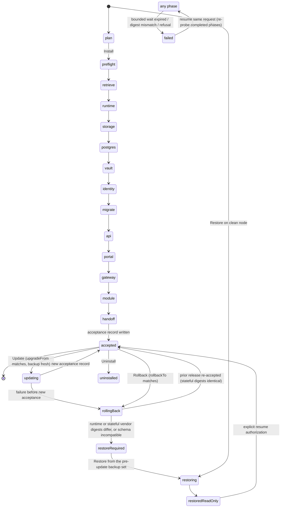

# CloudGrange product installer design (F12, Wave 4)

**2026-09-14 update:** per [`runtime-and-platform-reset.md`](https://github.com/CloudGrange/cloudgrange-internal/blob/main/pmo/decisions-2026-09-14/runtime-and-platform-reset.md), the runtime target is Docker Compose on a single Ubuntu VM (ADR-029), not RKE2. **The Compose installer (built from the legacy compose-era scripts at repo root) is the M0/M1 product path.** The RKE2 BOM installer design below, and the `experiments/compact-rke2` checkpoint pattern it draws on, are retained as a **future optional profile** — not deleted — for the case where the two-VM Compose HA option also proves insufficient.

**Status:** authoritative implementation design for F12-1 (Story AB#8129, Tasks 9015–9018), the installer-side contract for F12-4 (AB#8130, Tasks 9019–9021) and M0-compact-restore (AB#8893, Tasks 9032–9034). Written 2026-09-12 for the Wave 4 implementation agents. **Revision 2** (same day) resolves independent review `installer-5`: the site configuration now consumes the infrastructure `cg-site-config-v1` contract as-is (§1.6–§1.7), OpenBao bootstrap and the setup token are durably recoverable (§3.4 phases 6, 9, 13), migration is its own phase (phase 8), the checkpoint chain has an exact atomic write order and recovery table (§3.2), and the BOM schema ships with fixtures and a CI check (§2.3). It adds no ADO scope and closes nothing; ADO remains the status authority.

**Governing inputs (read at these revisions):** cloudgrange-internal `b47ddb8` (`m0-m1-implementation-plan.md` §4 Wave 4 and §5, `m0-task-register.md`, `compact-runtime-qualification.md`, `m0-signing-authority.md` CG-015, `foundation-architecture.md`); cloudgrange-platform-workflows `979dd01` (`docs/signing-design.md`, `docs/composition-content.md`, `docs/release-evidence-contract.md`, `schemas/*`); cloudgrange-infrastructure `1d487fa` (PR #7 merged: `schemas/site-config-v1.schema.json`, `docs/site-configuration.md`) **plus PR #8 head `c2c608b` as the site-config authority** (`$id` `cg-site-config-v1`, `secretref://` providers, `scripts/management/SecretRef.psm1`), `schemas/compact-topology-v1.schema.json`, `docs/compact-management-contract.md`; this repository `eb7cf90` (`experiments/compact-rke2/*`, `teardown-and-promotion.md`); edge audit 2026-09-12 (installer section).

**Owner decisions applied:** the lab only receives published releases (plan §2 rule 1); `cglab-mgmt01` is reset to clean Ubuntu before the M0 release is installed, so there is **no adoption path** for the frozen experiment (§1a.3); one active Story per repository (§1a.1). Shell policy as clarified by the orchestrator: the Linux installer is `pwsh` (PowerShell 7); the Windows host agent wrapper runs under Windows PowerShell 5.1.

---

## 0. What exists, what this design builds, what is deferred

| Exists today (reusable) | Built by this design | Deferred (named, not silent) |
|---|---|---|
| `experiments/compact-rke2/Invoke-CompactRke2Experiment.ps1`: root PS7 on Ubuntu 24.04, SHA-256 of pinned RKE2 tarballs before extraction, request-identity checkpoint, foreign-runtime refusal, bounded readiness wait (qualified in pipelines 976–999) — **future optional profile only; not the M0/M1 runtime** | The product installer under `installer/`: 13 phases, atomic hash-chained checkpoints, resume/refusal rules, evidence, modes Plan/Install/Verify/Update/Rollback/Restore/Uninstall, targeting Docker Compose on a single Ubuntu VM | RKE2/K3s multi-node profiles; Bundled and Appliance packaging (BOM schema already supports them); arm64 |
| `CloudGrange.ReleaseTrust` library (platform-workflows): strict JWS/ES256 verifier, policy/catalog history, composition byte closure (fixture-size bounds) | `cg-trust` self-contained CLI host and an operational large-artifact profile (cross-repo work package, §11) | Public Sigstore/attestations; TUF; Authenticode; MSI for the agent; agent self-update |
| Infrastructure `cg-site-config-v1` (kind `CloudGrangeSiteConfig`, `schema_version` 1; PR #7 merged, PR #8 adds `secretref://` and `SecretRef.psm1`), its validator and fixtures; `compact-topology-v1` and `Test-CompactPrerequisite.ps1` | Consumption of that contract as-is, a short list of v1.1 additions (§1.7) and the site-config → topology conversion (WP-05) | Enterprise OIDC federation at install time (Keycloak local realm only in M0) |
| Component Dockerfiles for api, portal, relay; agent `Install-Agent.ps1` (sc.exe, shared-token enrollment) | Per-component Helm charts in this repo; GHCR names `ghcr.io/cloudgrange/<component>`; agent release package with `install`/`enroll` verbs (agent repo) | PITR/WAL backup (format decided by 8892); certificate-rotation mode; OCI publication of charts (charts ship in the bundle only) |
| Legacy compose-era `Install-/Update-/Uninstall-CloudGrange.ps1` at repo root | **Promoted to the product installer under `installer/`** — this is the M0/M1 product path, not archived | Air-gap certification (Online cached resume only, per qualification 986) |

Nothing in this document claims a passing runtime test. Every "must" below is an acceptance obligation for the named work package.

---

## 1. Customer journey

Persona: "Grange Farms IT" (plan §5). No repository access; only the GitHub Release page, published docs, a site config written from the published schema, and their own credentials.

### 1.1 What is downloaded

All customer-facing assets are attached to one GitHub Release on `CloudGrange/cloudgrange-deployment-installer`, tag `v<version>` (first candidate `v0.1.0-m0.rc1`). Names are exact; `<ver>` is the product version without the `v`.

| Asset | Content | Who uses it |
|---|---|---|
| `cloudgrange-install-<ver>-linux-x64.tar.gz` | The **install bundle** (§1.2): installer scripts, `cg-trust` verifier, trust checkpoint, release BOM, composition manifest, catalog/policy/candidate envelopes, evidence inventory, charts, schemas, example site config, docs | Management node |
| `cloudgrange-release-bom-<ver>.json` | Copy of the BOM inside the bundle (`cg-release-bom-v1`, §2) | Auditors, the lab harness |
| `cloudgrange-proof-<ver>.zip` | Copy of `release/` from the bundle: `catalog.jws`, `policy/*.jws`, `candidates/*.jws`, `composition-manifest.json`, `evidence/*` | Auditors, Windows hosts |
| `cloudgrange-agent-<ver>-win-x64.zip` | Agent package (§6); original bytes re-attached by the publisher after digest readback | Hyper-V hosts |
| `cloudgrange-module-example-<ver>.cgmod` | Signed reference module package (F08-1 format) | Installer (module phase); operators reinstalling |
| `cg-trust-<ver>-win-x64.zip` | Verifier for optional offline verification on Windows | Hyper-V hosts (optional) |
| `trust-checkpoint-m0-internal.json` | Copy of the trust checkpoint inside the bundle | Convenience only; authority comes from §1.3 |
| `SHA256SUMS` | Digest of every asset above | Transport-corruption check only |
| `release-notes-<ver>.md` | Versioned notes, support-end date, known limits | Everyone |

Large vendor artifacts (RKE2 runtime tarball ~41 MB, RKE2 image archive ~801 MB) and all container images are **not** release assets; they are retrieved by exact digest during the retrieve phase (§4). The Bundled profile (deferred) transports the same members in a second tarball without changing the BOM.

### 1.2 Install bundle layout

```
cloudgrange-install-<ver>-linux-x64/
  Install-CloudGrange.ps1                 single entry point (all modes)
  modules/CloudGrange.Installer/          phase engine, checkpoint, retrieval, evidence
  bin/cg-trust                            self-contained linux-x64 verifier (platform-workflows)
  trust/checkpoint-m0-internal.json       owner-authenticated trust checkpoint (root SPKI, floors)
  release/release-bom.json                cg-release-bom-v1
  release/composition-manifest.json       cg-composition-v1 (lists EVERY file in this tree by digest)
  release/catalog.jws                     cg-catalog-v1 (admission role)
  release/policy/<sequence>.jws           cg-policy-v1 chain needed for catch-up
  release/candidates/<artifactSha256>.jws cg-candidate-v1, one per member
  release/evidence/                       composition qualification, producer and curator evidence
  charts/<name>-<chartVersion>.tgz        first-party and curated vendor charts
  management/                             infrastructure scripts archive contents (site-config validator,
                                          SecretRef.psm1, topology conversion, prerequisite predicate)
  schemas/site-config-v1.schema.json      infrastructure cg-site-config-v1 (kind CloudGrangeSiteConfig, schema_version 1)
  schemas/release-bom.schema.json
  schemas/install-checkpoint-v1.schema.json
  examples/site-config.example.json       copy of infrastructure tests/contract/fixtures/site-config/valid-minimal.json
  docs/                                   install, trust, enrollment, update, restore, uninstall
  SHA256SUMS
```

### 1.3 Offline verification (what the customer checks, in order)

1. **Independent channel first.** The product website (`cloudgrange.cloud/trust`, Cloudflare-hosted, not GitHub) publishes for each release: the SHA-256 of `cloudgrange-install-<ver>-linux-x64.tar.gz`, the `m0-internal` root key fingerprint (`sha256:<hex>` of the DER SPKI), the trust-checkpoint SHA-256 and the current catalog sequence for the channel. For the lab, the same values are in the owner's vault record. The customer compares the downloaded bundle's SHA-256 to that value before extracting. A bundle that authenticates itself is not accepted (CG-015 "unbootstrapped" rule).
2. **Verifier and trust root come from the authenticated bundle.** `bin/cg-trust` and `trust/checkpoint-m0-internal.json` are covered by step 1.
3. **The running tree is bound to the manifest.** Every mode of `Install-CloudGrange.ps1` starts, before importing any module, by running `bin/cg-trust verify-tree --manifest release/composition-manifest.json --root .`, which hashes every listed file in the extracted tree (the entry script, `modules/`, `management/`, `bin/cg-trust` itself, charts, schemas, docs) and refuses on any difference or extra executable file. The same check runs on every resume and every Update, so what executes is always the verified bytes, not merely an archive that was verified once. On resume the entry script also pins the manifest itself: it reads `compositionSha256` from protected state outside the bundle (`trust/accepted-composition.json`, else `checkpoint.json` / `.prev` / `.tmp`) without importing any bundle code, and passes `--composition-sha256 <pin>`, so a consistent rewrite of the manifest plus a module cannot pass. The pin is omitted only when the state directory is absent or holds nothing but `install.lock` / `install.owner` (a first run, or a crash between taking the lock and the first checkpoint); any other installer state that yields no digest is refused with `composition-pin-unavailable` (fail closed). The `installer-archive` member is the candidate-signed source of those files; WP-20 asserts at assembly that the archive members equal the manifest entries.
4. **`Install-CloudGrange.ps1 -Mode Plan`** runs `cg-trust verify-composition`. Verification order is fixed: checkpoint floors → policy chain (catch-up allowed, terminal must be fresh) → catalog (admission role, `catalogSequence` ≥ floor) → composition manifest bytes (`compositionSha256`) → BOM bytes (`bomSha256`), configuration schema bytes (`configurationSchemaSha256`), qualification bytes → every candidate envelope against its catalog member pair → every small artifact and evidence file by exact digest and size. Signature format is CG-015: compact JWS, `alg=ES256`, `kid=sha256:<SPKI digest>`, 64-byte R||S signature, closed schemas, 300 s skew, 30-day validity, revocation sets.
5. **Large artifacts** (files above the 16 MiB fixture bound: RKE2 archives, image tarballs, agent package) are verified by the installer with streaming SHA-256 against the digests in the *already verified* manifest and BOM, immediately after retrieval and again immediately before each use. `cg-trust` gains an operational profile that reports these members as `digest-only` instead of loading them (§11, WP-03).
6. **Result** is written as `evidence/<installId>/trust-verification.json` with reason codes; any denial stops before any mutation and preserves the bundle.

### 1.4 Prerequisites the customer provides

| Requirement | Detail |
|---|---|
| Management VM | Clean Ubuntu 24.04 LTS x86_64 (dated Canonical image per `compact-runtime-qualification.md`), ≥ 8 vCPU / 32 GiB, ≥ 200 GiB system disk, separate ext4 data disk ≥ 256 GiB mounted at `/var/lib/rancher` (site-config `management_node.disks` constants), systemd, iptables, NTP synchronized |
| PowerShell 7 on the node | Installed from Microsoft's apt repository per vendor docs; the installer refuses versions below `compatibility.installer.powershellMinimum` and records the exact version. Bundling PS7 is deferred to the Bundled profile |
| DNS | `endpoint.dns_name` (operators, portal, API, Keycloak) and the device endpoint name (agents, §5.4), default `devices.<endpoint.dns_name>`, both resolving to the published address. In the lab both are lab-tooling records |
| TLS | `endpoint.tls.mode: customer_ca` (CA bundle path and digest, certificate and key references) or `generated` (installer creates a site CA the customer must distribute; `validity_days`) |
| Escrow | `vault.recovery_escrow` (kind, independent location, custodian, `key_shares`, `key_threshold`) plus the v1.1 recipient public key (§1.7) whose private half stays with the custodian, off the node |
| Backup | `backup` is mandatory in v1: independent `webdav`, `s3` or `filesystem` location, credential reference and the customer-supplied `encryption_key_ref`. Preflight requires authenticated access |
| Secret references | Preferred `secretref://<provider>/<path>[#version]` with the closed provider set `file` (root-owned regular file, `0600`), `env` (installer process environment), `azurekeyvault` (optional, never required) and `openbao` (rejected in the site file; installer-internal after the vault phase). Legacy `env://NAME`, `file:///path`, `keyvault://vault/secret` and `openbao://path` remain accepted and mean the same secrets. Note `azurekeyvault` is a *provider*; `keyvault` is only an escrow *kind* |
| Registry access | Public GHCR for the first release; a credential reference is accepted for private packages (§4.2) |
| Hyper-V hosts | Windows Server 2025, local administrator, Windows PowerShell 5.1 (in-box), outbound TCP 443 to the device endpoint name |

### 1.5 The single entry command

```bash
sudo pwsh ./installer/Install-CloudGrange.ps1 -Mode Install -SiteConfig /etc/cloudgrange/site-config.json -TrustCheckpointSha256 <hex>
```

`-TrustCheckpointSha256` is the SHA-256 of `trust/checkpoint-<channel>.json` as published on the independent channel (§1.3 step 1); `Plan` and `Install` require it and pass it to `cg-trust verify-composition --checkpoint-sha256`, which never derives it from the bundled file. The entry point is `installer/Install-CloudGrange.ps1` in this repository; its location inside the assembled bundle is fixed by WP-20 with the composition manifest. `-Mode Plan` performs every check and no mutation; `Verify` re-probes an installed system; `Update`, `Rollback`, `Restore`, `Uninstall` are §3.3. All modes take the same `-SiteConfig`. Environment choices that are not site identity and have no v1 field (§1.7) are parameters: `-ArtifactMirror <https base>`, `-RegistryCredentialRef <secretref>`, `-EscrowMountPath` / `-BackupMountPath` (only for `filesystem` kinds). There is no other script for the customer to run on the management node.

### 1.6 The site config file: `cg-site-config-v1` (infrastructure PR #7 merged, PR #8 authority)

Identity: `$id` `https://cloudgrange.cloud/schemas/cg-site-config-v1.schema.json`, file `schemas/site-config-v1.schema.json`, documents carry `kind: CloudGrangeSiteConfig` and `schema_version: 1`. The installer consumes it **as-is**: it validates with the bundled `management/Test-CloudGrangeSiteConfig.ps1` (closed schema, `INLINE_SECRET`, `SECRET_REFERENCE_INVALID`, `SECRET_PROVIDER_UNSUPPORTED`, cross-field codes) and binds `config_sha256` into the request identity; it resolves references only through `management/SecretRef.psm1` (`Resolve-SecretRef`, `SecureString` or bytes) and redacts evidence with `New-SecretRefRedactor`/`Protect-SecretRefText`. The BOM binds the schema by `schemaId` + `kind` + `schemaVersion` + file digest (§2.3). Release and platform data that the earlier draft put in the site file (channel, artifact identities, image digests, component versions) come from the **BOM**, not the site file. Reconciliation of every input this design needs against the v1 model:

| Design need | v1 path | Resolution |
|---|---|---|
| Node, host, disks, addresses | `management_node.*` | Consumed as-is; identical constraints to `compact-topology-v1` |
| Runtime networks, external DNS, publication | `network.*` | As-is |
| Operator endpoint name | `endpoint.dns_name` | As-is |
| Device endpoint name for agent SNI (§5.4) | none | Convention `devices.<endpoint.dns_name>`; optional override is a v1.1 addition |
| TLS mode | `endpoint.tls.mode` `customer_ca` \| `generated`, SANs, CA bundle, cert/key refs, `validity_days` | As-is; the design term "internal-ca" is replaced by `generated` |
| Outbound trust anchors (backup, escrow, registry, proxy with private CAs) | none (`ca_bundle_path` exists only under `customer_ca`) | v1: OS trust store plus `endpoint.tls.ca_bundle_path` when present; a top-level outbound bundle is a v1.1 addition |
| Proxy | `proxy.*` incl. `no_proxy` | As-is |
| First administrator identity | `identity.bootstrap_admin {username, display_name, contact_email}` | As-is; carried into the setup handoff (phases 9/13); no password in the file |
| OpenBao escrow target and Shamir parameters | `vault.recovery_escrow {kind, location, ownership, credential_ref, custodian_contact, key_shares, key_threshold}` | As-is: `key_shares`/`key_threshold` drive `sys/init`; the earlier hard-coded 5/3 is removed. Delivery per kind in phase 6 |
| Escrow encryption recipient | none | **Wrong as merged:** unseal shares and a root token written to a WebDAV/S3/file location or handed to a custodian must be encrypted to a key whose private half is off-node. v1.1 addition; the installer refuses to init OpenBao without it (`ESCROW_RECIPIENT_MISSING`) |
| Backup destination, credential, retention | `backup.*` | As-is; mandatory. The earlier `defer_until_setup` is dropped |
| Backup encryption key | `backup.encryption_key_ref` (customer-supplied) | Adopted: the installer resolves the reference and hands the material to the backup component as `Secret cg-backup-key` without interpreting it; whether it is a public key (recommended so the decryption key never resides on the node) or symmetric is the 8892 format decision. The installer no longer generates a backup key |
| NTP | `ntp.servers` | As-is |
| Hosts to enroll | `hyperv_enrollment` | Recorded into `ConfigMap cg-site-config` (references unresolved) so the portal can prefill enrollment (F10); nothing enrolled at install |
| Telemetry | `telemetry` | Off unless explicitly enabled; passed to the API config |
| Artifact source, mirror, registry credential, cache root | none | v1: command-line parameters (§1.5); v1.1 optional section |
| Data volume sizes | none | v1: derived from `management_node.disks.data_gib` (postgres 60 GiB, openbao 5, gateway 5, blob = remainder minus 40 GiB cache reserve, all checked in preflight); v1.1 optional overrides |
| Recovery access for the prerequisite predicate | `management_node.admin_ssh_key_ref` (optional) | Conversion maps to topology `recovery {transport: ssh, target: node, credential_ref}`; missing → predicate `recovery_access_verified=false` blocks. v1.1 makes this explicit |
| Live preflight input | `compact-topology-v1` | `management/ConvertTo-CompactTopology.ps1` (WP-05) derives the topology document from the site config; the predicate runs unchanged |

### 1.7 Required site-config v1.1 changes (implemented by WP-05, infrastructure; additive, closed)

| # | Change | Why |
|---|---|---|
| 1 | `vault.recovery_escrow.recipient_key_ref` (secret_ref to an RSA-4096 public key PEM; public material, so `secretref://file/...` is fine) and `vault.recovery_escrow.recipient_key_sha256` (SPKI digest), both required | Escrow bundles are encrypted to the custodian (§3.4 phase 6). `key_shares`/`key_threshold` stay |
| 2 | `endpoint.device_dns_name` (optional, default `devices.<dns_name>`) | Agent SNI passthrough name (§5.4) |
| 3 | `trust.ca_bundle_path` / `trust.ca_bundle_sha256` (optional top-level) | Outbound trust anchors independent of TLS mode |
| 4 | `artifacts { source: github \| mirror, mirror_base_uri, registry_credential_ref, cache_root }` (optional) | Replaces the v1 command-line parameters |
| 5 | `storage.volumes { postgres_gib, openbao_gib, blob_gib, gateway_gib }` (optional overrides) | Static PV sizes (§5.1) |
| 6 | `recovery { transport: ssh \| azure_run_command, target, credential_ref }` (optional; when absent, derived from `admin_ssh_key_ref`) | Predicate recovery-access input |
| 7 | `management/ConvertTo-CompactTopology.ps1` in the management scripts archive, and `compact-topology-v1` `storage.backup.uri` accepting the `file://server/...` form for `filesystem` backups | Live preflight from the site config |

Delivered already by PR #8 and therefore not requested again: the `$id`/title identity and the `secretref://` provider set with `SecretRef.psm1`. None of the items above change existing v1 fields or validation codes; a valid v1 file remains valid after WP-05 except that item 1 becomes required for install.

### 1.8 What the customer sees at the end

The installer prints exactly once (and keeps an encrypted copy, §3.4 phase 9):

```
CloudGrange 0.1.0-m0.rc1 is installed and awaiting setup.
Open https://<endpoint.dns_name>/setup, sign in as '<identity.bootstrap_admin.username>' with the one-use setup token below.
Token: <64 hex>   Expires: <UTC>
Escrow bundle <sha256> is at <location or state/escrow path>. Confirm custody with -AcknowledgeEscrow <sha256>.
```

Setup in the portal (F10-1) creates the first administrator through the API's guarded setup contract (8894) using the token and the configured bootstrap identity, completes the production identity transition to the local Keycloak realm, and permanently disables setup. The installer never sends an admin password.

---

## 2. Release BOM

### 2.1 Role in the trust chain

The BOM (`cg-release-bom-v1`) is an **evidence file**, not a JWS. It is signed by being bound: `bomSha256` appears in the `cg-composition-v1` manifest and in the `cg-catalog-v1` admission envelope, which Kristopher approves as an immutable payload (CG-015). The catalog's `members` array of `{artifactSha256, candidatePayloadSha256}` must equal the BOM's members one-to-one; each member's `provenance` must equal the `producer` fields of its authenticated candidate statement. The BOM never contains its own digest, the manifest digest or a catalog digest (acyclic order in `release-evidence-contract.md`).

Binding to source and CI: every member carries `provenance {repository, repositoryId, workflowPath, ref=refs/heads/main, sourceSha, runId, runAttempt}` copied from its candidate; the composition run itself is `assembly {…, compositionLockSha256}`; the composition qualification file (bound by `qualificationSha256`) records the assembly run and every member's evidence digests. Producer run IDs are GitHub Actions run IDs; signer run IDs live in the candidates, not the BOM.

### 2.2 Members of the M0 composition

Exact versions are selected by the curator and producer work packages and measured, not guessed here. Families and identities:

| id | kind | phase | name (digest-pinned at build) | Producer |
|---|---|---|---|---|
| `cg-trust` | verifier | preflight | `bin/cg-trust` linux-x64 self-contained | platform-workflows |
| `installer-archive` | installer-archive | preflight | `cloudgrange-installer-<ver>.zip` (scripts + modules; equals the bundle's executable files) | This repo |
| `management-scripts` | script-archive | preflight | `cloudgrange-management-scripts-<ver>.zip` (site-config validator, `SecretRef.psm1`, topology conversion, predicate, schema) | infrastructure |
| `rke2-runtime` | vendor-archive | runtime | `rke2.linux-amd64.tar.gz` (v1.36.4+rke2r1, sha256 `7bcbd316…`) | Curator: this repo |
| `rke2-images` | vendor-archive | runtime | `rke2-images.linux-amd64.tar.zst` (sha256 `03b82bfa…`); curator evidence enumerates every embedded image digest and its digest is `compatibility.kubernetes.imageInventorySha256` | Curator |
| `cg-base` | helm-chart | storage | `charts/cg-base` | This repo |
| `cnpg-operator-chart` | vendor-helm-chart | postgres | `cloudnative-pg` upstream chart `.tgz` | Curator |
| `cnpg-operator-image` | vendor-oci-image | postgres | `ghcr.io/cloudgrange/vendor/cloudnative-pg@sha256:…` (mirrorOf upstream) | Curator |
| `postgresql-image` | vendor-oci-image | postgres | `ghcr.io/cloudgrange/vendor/postgresql@sha256:…` (PG 17.x CNPG image) | Curator |
| `cg-postgres` | helm-chart | postgres | `charts/cg-postgres` (CNPG `Cluster`, roles, databases) | This repo |
| `openbao-image` | vendor-oci-image | vault | `ghcr.io/cloudgrange/vendor/openbao@sha256:…` (version per F07-1) | Curator |
| `cg-openbao` | helm-chart | vault | `charts/cg-openbao` (config from F07-3 contract) | This repo |
| `keycloak-image` | vendor-oci-image | identity | `ghcr.io/cloudgrange/vendor/keycloak@sha256:…` (26.x) | Curator |
| `cg-keycloak` | helm-chart | identity | `charts/cg-keycloak` (realm template from F04-1) | This repo |
| `api-image` | oci-image | migrate | `ghcr.io/cloudgrange/api@sha256:…` (hosts Core and Identity; `migrate` entrypoint) | platform-api |
| `cg-api` | helm-chart | api | `charts/cg-api` (Deployment, Service, IngressRoute; no Job) | This repo |
| `portal-image` | oci-image | portal | `ghcr.io/cloudgrange/portal@sha256:…` | portal |
| `cg-portal` | helm-chart | portal | `charts/cg-portal` | This repo |
| `gateway-image` | oci-image | gateway | `ghcr.io/cloudgrange/gateway@sha256:…` (runtime-relay) | runtime-relay |
| `cg-gateway` | helm-chart | gateway | `charts/cg-gateway` | This repo |
| `module-example` | module-package | module | `cloudgrange-module-example-<ver>.cgmod` | module-example |
| `agent-package` | agent-package | handoff | `cloudgrange-agent-<ver>-win-x64.zip` | runtime-agent |

Not members: the BOM, manifest, catalog, policies, candidates, trust checkpoint, schemas, docs, `SHA256SUMS` (evidence or trust inputs, listed in the composition manifest with role `evidence` where applicable).

**Digest semantics (one rule per kind).** For `oci-image` and `vendor-oci-image`, `sha256` is the **linux/amd64 image manifest digest** (hex, no prefix), equal to the digest in `retrieval.reference`. For every other kind, including charts, `sha256` is the **SHA-256 of the file bytes**; charts are always `bundled` `.tgz` files in M0 (OCI chart publication is deferred, which removes the manifest-vs-file ambiguity). M0 builds `linux/amd64` only with buildx attestations disabled (`provenance: false`, `sbom: false`) so the pushed object is a single image manifest, not an attestation-bearing index; SBOM and provenance are detached evidence files per the release-evidence contract. Vendor images are mirrored to `ghcr.io/cloudgrange/vendor/<name>` with a digest-preserving copy of the **platform manifest** (`crane copy --platform linux/amd64` or equivalent), so `reference` and `mirrorOf` carry the same digest and neither is a multi-arch index; the curator evidence records the upstream checksum/signature/index observation.

### 2.3 Schema, fixtures and CI

`schemas/release-bom.schema.json` is the closed structural schema: draft 2020-12, `additionalProperties: false` throughout, digest-pinned OCI references with an explicit dotted registry host (no tags, no tag+digest, no implicit docker.io), canonical `https` URIs (dotted DNS host, no IP literal, no userinfo/query/fragment; every percent escape well-formed and never encoding `/`, `\`, `.` or `%`, so no encoded separator or double encoding; no empty, `.` or `..` segment, a single trailing `/` allowed; no `latest` segment in any letter case, including one spelled with escaped letters — the same rules as cg-trust `ReleaseBomVerifier.Https`, except that the installer refuses `latest` as any segment and refuses IP literals), release-asset tags in the exact release-tag grammar, retrieval type constrained per kind (images → `oci`; charts → `bundled`; vendor archives → `https`/`bundled`; packages, verifier and script archives → `github-release-asset`/`bundled`), `vendor` required for `vendor-*` kinds and forbidden otherwise, `evidence.sbomSha256` required for `oci-image`, `helm-chart`, `agent-package`, `module-package`, `installer-archive` and `verifier` (G10), `configurationSchema {schemaId: cg-site-config-v1, kind: CloudGrangeSiteConfig, schemaVersion: 1, sha256, path}`, `compatibility.kubernetes.imageInventorySha256`, and `upgradeFrom[]` / `rollbackTo[]` (each `{version, bomSha256}`).

What JSON Schema cannot express is checked by `test/Test-ReleaseBomSchema.ps1` and becomes `Test-CgReleaseBom.ps1` in WP-02: unique member ids, resolvable acyclic `dependsOn`, no dependency on a later phase, `sha256` equal to the `reference`/`mirrorOf` digest for OCI kinds, unique artifact digests; WP-02 adds member ↔ catalog set equality and provenance ↔ candidate equality using `m0-fixture` envelopes. Fixtures: `schemas/fixtures/release-bom.valid.json` (ten members covering every retrieval type) and `schemas/fixtures/release-bom.invalid-cases.json` (46 patch cases, each expected to fail the schema or the semantic checks). CI runs the test from `test/Invoke-InstallerSourceQualification.ps1` and records `release_bom_cases`.

### 2.4 Composition manifest and the large-artifact split

`cg-composition-v1` lists every artifact and evidence file with logical path, role, digest and size. The current `CompositionContentVerifier` bounds are fixture-sized (16 MiB per file, 64 MiB aggregate). The operational profile (WP-03) keeps those bounds for loaded content and adds `digest-only` members: the manifest still names the large file and its digest, the verifier proves the manifest/catalog/candidate closure, and the installer proves the bytes by streaming hash. Both results are recorded in the trust-verification evidence with the same manifest digest so the binding is auditable.

---

## 3. Installer state machine

### 3.1 On-node layout

| Path | Disk | Content |
|---|---|---|
| `/etc/cloudgrange/site-config.json` | system | Accepted site config copy (0600); its SHA-256 is part of the request identity |
| `/var/lib/cloudgrange/state/` | system | `checkpoint.json` (+ `checkpoint.prev`, `checkpoint.tmp`), `install.lock` (+ `install.owner`, the holder's PID while locked), `keys/node.key` (0400), `vault/recovery.envelope`, `handoff/setup-token.envelope`, `escrow/` (encrypted bundles + `escrow-manifest.json`), `trust/` (accepted-composition record, floors, last-good time), `releases/<version>/` (bundle copy: BOM, manifest, proofs, rendered values) |
| `/var/lib/cloudgrange/state/evidence/<installId>/<attempt>/<phase>/` | system | Redacted phase evidence (§3.5) |
| `/var/lib/rancher/cloudgrange/cache/sha256/<hex>` | data | Content-addressed offline cache (§4.3) |
| `/var/lib/rancher/cloudgrange/volumes/{postgres,openbao,blob,gateway}` | data | Static local PV backing directories |
| `/var/lib/rancher/rke2`, `/etc/rancher/rke2` | data / system | RKE2 as in the experiment (`data-dir: /var/lib/rancher/rke2`) |

`keys/node.key` is 32 random bytes generated once at the first `Install` (never in `Plan`), root-only, on the system disk, excluded from every backup set. Node-local envelopes are AES-256-GCM under this key with AAD `installId|purpose`; they make crash recovery possible without the custodian's private key and are within the node trust boundary (a hostile root on the node already owns the vault data). The independent copies are the escrow bundles (§3.4 phase 6).

### 3.2 Checkpoint contract (`cg-install-checkpoint-v1`)

```json
{
  "schema": "cg-install-checkpoint-v1",
  "installId": "<uuid, generated once on first Install>",
  "sequence": 17,
  "mode": "Install",
  "requestSha256": "<sha256(site-config bytes || 32 raw bytes of compositionSha256 || 32 raw bytes of catalogPayloadSha256)>",
  "compositionSha256": "<hex of release/composition-manifest.json; the entry script's verify-tree pin on resume>",
  "bomSha256": "<hex>", "catalogPayloadSha256": "<hex>", "productVersion": "0.1.0-m0.rc1",
  "attempt": 3,
  "phase": "vault", "phaseState": "started", "subState": "init_requested",
  "terminal": "<absent until the run ends for this request; then accepted | failed:<phase>>",
  "phases": {
    "preflight": {"state": "completed", "startedUtc": "...", "completedUtc": "...", "outputsSha256": "<hex>"},
    "retrieve":  {"state": "completed"},
    "runtime":   {"state": "completed", "outputs": {"nodeUid": "...", "bootId": "..."}}
  },
  "updatedUtc": "...",
  "previousCheckpointSha256": "<sha256 of the previous checkpoint.json bytes, 64 zeros for the first>"
}
```

**Atomic write order (every checkpoint):**

1. Compute `previousCheckpointSha256 = sha256(bytes of current checkpoint.json)` (64 zeros if none) and `sequence = current.sequence + 1`; serialize to bytes.
2. Write `checkpoint.tmp`; `fsync` the file.
3. If `checkpoint.json` exists: unlink `checkpoint.prev` if present, then **hard-link** `checkpoint.json` → `checkpoint.prev` (current keeps existing; no window without a current file).
4. `rename(checkpoint.tmp, checkpoint.json)` (atomic replace).
5. `fsync` the state directory.

**Recovery on start (before any lock-protected work), computed from whatever exists:**

| Files present | Condition | Action |
|---|---|---|
| `json` only | `json.previousCheckpointSha256` is 64 zeros | Resume from `json` |
| `json` + `prev`, no `tmp` | `json.prev == sha256(prev)` **or** `sha256(json) == sha256(prev)` (crash after step 3) | Resume from `json` |
| `json` + `tmp` (± `prev`) | `tmp` parses, `tmp.previousCheckpointSha256 == sha256(json)` and `tmp.sequence == json.sequence + 1` | Crash between steps 2 and 4: complete steps 3–5, resume from the new `json` |
| `json` + `tmp` | `tmp` unparsable, wrong predecessor or wrong sequence | Delete `tmp` (partial write), resume from `json` |
| `prev` + `tmp`, no `json` | Only possible after external damage | If `tmp` valid against `prev` → rename to `json`; else restore `json` from `prev` and record `checkpoint-restored-from-prev` |
| `json` unparsable | `prev` parses | Refuse with `checkpoint-corrupt`; both preserved; `-ResumeFromPrevious` (operator-confirmed) promotes `prev` after re-probing every phase it marks completed |
| Anything else | | Refuse with `checkpoint-corrupt`, nothing modified |

Other rules, inherited from the experiment:

- **One installer at a time:** `flock` on `install.lock`; a second invocation exits with `installer-already-running` and the holder's PID.
- **Request identity:** the checkpoint's `requestSha256` must equal the current inputs. A different site config or composition is refused (`request-mismatch; existing installation preserved`) except in `Update`, `Rollback` and `Restore`, which validate the transition explicitly (§7).
- **Secrets never enter the checkpoint.** Outputs are identities, digests, accessors and paths.
- `schemas/install-checkpoint-v1.schema.json` is closed; the installer validates its own checkpoint on every read.

### 3.3 Modes

| Mode | Effect | Terminal states |
|---|---|---|
| `Plan` | Tree and composition trust verification, site config validation, preflight observations and predicate, retrieval dry-run (sizes, sources, cache hits), no mutation | `plan-ok`, `plan-blocked` |
| `Install` | Phases 1–13 then durable acceptance; resumable | `accepted`, `failed:<phase>` |
| `Verify` | Re-runs every phase's postcondition probe against the accepted composition; warns on `recovery-keys-present-on-node`, unacknowledged escrow, expired setup token still present | `verified`, `drift:<phase>` |
| `Update` | §7.1; new bundle over an accepted composition | `accepted`, `failed:<phase>` with prior release retained |
| `Rollback` | §7.2; to the retained previous release | `accepted`, `rollback-requires-restore` |
| `Restore` | §7.3; clean node from recovery set | `restored-read-only`, `accepted`, `blocked:<reason>` |
| `Uninstall` | §3.7; retention levels | `uninstalled:<retention>` |

### 3.4 Phases

Order is fixed. Deviation from the plan's Wave 4 list (Keycloak 5, OpenBao 6) is deliberate: the vault comes **before** identity because Keycloak's database credential, bootstrap admin and OIDC client secret are generated into and mirrored from OpenBao, so identity has nothing to consume until the vault exists. For each phase: **pre** (preconditions), **do** (actions, idempotent), **probe** (postcondition re-checked on resume and in Verify), **checkpoint** (outputs recorded), **resume/rollback** rules, **evidence**. Bounded waits are explicit; expiry preserves state and fails with an attributable reason, never a retry loop.

#### Phase 1 `preflight`
- **pre:** root, PS7 ≥ minimum, tree and composition trust verified (§1.3).
- **do:** validate the site config with `management/Test-CloudGrangeSiteConfig.ps1` (unknown version, contradictions, inline secrets, malformed or unsupported `secretref://` → stop; bind `config_sha256`); derive the topology with `management/ConvertTo-CompactTopology.ps1`; run the installer-owned observation probe (OS/arch/hostname, CPU/memory, disk layout, `ip -j`, `lsblk -J`, `timedatectl`, DNS resolution of both endpoint names, NTP, free space incl. the derived volume sizes plus cache reserve, required flow connectivity, authenticated backup access per kind, escrow location reachability per kind, recovery access); write `compact-observations-v1`; invoke `management/Test-CompactPrerequisite.ps1` with topology and observations; resolve every reference once through `Resolve-SecretRef` to prove resolvability and discard the values (`openbao` provider unavailable by design at this point; `azurekeyvault` only when a token source is configured); load the escrow recipient public key (§1.7 item 1), compute its SPKI SHA-256 and compare to `recipient_key_sha256`; **foreign-runtime guard:** if `/usr/local/bin/rke2`, `/var/lib/rancher/rke2/server` or `/etc/rancher/rke2/config.yaml` exists without a matching checkpoint → `existing-runtime-without-checkpoint; preserved` (identical to the experiment; this is how a non-reset `cglab-mgmt01` is refused). In `Install`, create `state/keys/node.key` if absent.
- **probe:** predicate `passed=true` with the same topology digest; node key present (Install only).
- **checkpoint:** config digest, topology digest, observations digest, predicate result digest, recipient key SHA-256, PS7 version, node identities (machine-id, boot-id, data volume UUID).
- **resume:** always re-run (cheap, read-only apart from the key file). **rollback:** none.
- **evidence:** observations, predicate blockers, validator error codes (never values; evidence text passes through the SecretRef redactor).

#### Phase 2 `retrieve`
- **pre:** preflight completed; cache root exists on the data disk.
- **do:** for every BOM member in `dependsOn` order: if the cache holds `sha256/<hex>` with matching size and digest → reuse; else download by exact identity (§4) to `sha256/<hex>.partial`, stream-hash, compare size and digest, rename into place. Refuse redirects to hosts other than the allowlisted source hosts. Images are pulled by manifest digest and written as OCI-layout tarballs (§4.4).
- **probe:** every member present with matching digest (re-hash).
- **checkpoint:** `cache-index.json` digest (member id → cache path, digest, size, source, verifiedUtc).
- **resume:** per-member; partial files are discarded. Egress denial after a complete cache resumes without network (qualified pattern from run 986). **rollback:** none; cache is retained across failures.
- **evidence:** per-member source, bytes, elapsed, HTTP status codes; never tokens or URLs with credentials.

#### Phase 3 `runtime` (RKE2)
- **pre:** retrieve completed; foreign-runtime guard still true.
- **do:** promote the experiment engine: tar member allowlist check → extract to `/usr/local` (skip if the installed binary already has the BOM digest) → write `/etc/rancher/rke2/config.yaml` from the site config (node name/ip, `tls-san` incl. both endpoint names, canal, traefik, CIDRs, `write-kubeconfig-mode: 0600`) → stage `rke2-images` **and every product/vendor image tarball** into `/var/lib/rancher/rke2/agent/images/` (re-hash before copy) → write `HelmChartConfig` for `rke2-traefik` into `/var/lib/rancher/rke2/server/manifests/` (websecure only: `ports.web.expose: false`; `providers.kubernetesCRD.allowCrossNamespace: false`; default `TLSOption` minimum TLS 1.2) → `systemctl daemon-reload`, `enable`, `start --no-block rke2-server` → wait for `/readyz` and the single node `Ready` (20 min) → wait for Canal and Traefik `HelmChart` `Failed=False` (10 min) → compare `crictl images --digests` with the `rke2-images` curator inventory (`imageInventorySha256`) and with every staged product/vendor reference; any missing or extra digest fails (`runtime-image-inventory-mismatch`).
- **probe:** node Ready, binary digest, config bytes identical, image inventory equal.
- **checkpoint:** `runtime_prepared` → `runtime_start_requested` → `node_ready` (kept as sub-states for interruption evidence), node UID, boot ID, RKE2 version output, inventory digest.
- **resume:** on `runtime_start_requested` re-enter the wait (qualified in run 989). **rollback:** none automatic; the runtime is retained for inspection. Only `Uninstall` removes it.
- **evidence:** `nodes.json`, `pods.json`, `charts.json`, `crictl images` listing, `journalctl -u rke2-server` tail (bounded).

#### Phase 4 `storage`
- **pre:** node Ready.
- **do:** apply `cg-base` via a `HelmChart` CR with `chartContent` (§5.5): namespaces `cloudgrange-system`, `cloudgrange`; `StorageClass cloudgrange-local` (`kubernetes.io/no-provisioner`, `WaitForFirstConsumer`); static `local` PersistentVolumes for postgres/openbao/blob/gateway with the derived sizes, `nodeAffinity` to the node, labels `cloudgrange.cloud/volume=<name>`, backing directories created 0700; default-deny `NetworkPolicy` in `cloudgrange` plus explicit allows (ingress from Traefik namespace, api→postgres, api→openbao, api→keycloak, migrate→postgres/openbao, gateway→api, keycloak→postgres, DNS egress); `ConfigMap cg-ca-bundle` (OS trust store + `endpoint.tls.ca_bundle_path` + v1.1 outbound bundle); `ServiceAccounts` `cloudgrange-installer`, `cloudgrange-migrate`, `cloudgrange-api`, `cloudgrange-gateway` with minimum RBAC; `ConfigMap cg-site-config` (redacted copy); TLS: `customer_ca` → `Secret cg-endpoint-tls` from the references; `generated` → generate site CA (P-256, `validity_days`) and one leaf covering the SANs and both endpoint names, write `cg-endpoint-tls`, keep the CA key in `Secret cg-site-ca-bootstrap` (removed in phase 6 after import into OpenBao PKI) and add the CA to `cg-ca-bundle`; `TLSStore default` → `cg-endpoint-tls`.
- **probe:** HelmChart succeeded; PVs `Available`/`Bound`; TLS secret matches the certificate digest; policies present.
- **checkpoint:** chart digest, PV names and sizes, certificate SHA-256 and expiry, CA SHA-256.
- **resume/rollback:** re-apply is idempotent; existing generated CA/leaf are reused (never regenerated on resume); nothing to undo.
- **evidence:** rendered values (redacted), `kubectl get pv,sc,networkpolicy -o json`.

#### Phase 5 `postgres` (CloudNativePG operator + PG 17 cluster)
- **pre:** storage completed.
- **do:** `HelmChart` for the curated `cloudnative-pg` operator chart (operator image by digest) in `cloudgrange-system`; wait operator Ready (10 min). Role passwords (`cg_migrate`, `cg_runtime`, `cg_audit_export`, `keycloak`): generate 32 random bytes **only if the Secret is absent**; an existing Secret is reused, never rotated by resume (bootstrap copy; mirrored into OpenBao in phase 6). `HelmChart cg-postgres`: CNPG `Cluster cg-postgres` with `instances: 1`, PG 17 image by digest, `storage.pvcTemplate` selecting the `postgres` PV, `enableSuperuserAccess: false`, `bootstrap.initdb` creating databases `cloudgrange` (owner `cg_migrate`) and `keycloak` (owner `keycloak`), `managed.roles` with `passwordSecret` for the four roles, `postgresql.parameters` from the F09-1 baseline, backup section from the 8892 contract (`Secret cg-backup-key` from `backup.encryption_key_ref`, destination from `backup.*`). Wait `Cluster` phase `Cluster in healthy state` (10 min).
- **probe:** cluster healthy, `cg-postgres-rw` service resolves, role login for `cg_migrate` succeeds via a short-lived `psql` Job.
- **checkpoint:** operator chart digest, cluster CR digest, database and role names (not passwords), PG server version string.
- **resume:** CR re-apply is idempotent; if the cluster exists with a different image digest → `postgres-image-mismatch; preserved` (Update is the only path that changes it). **rollback:** none; data volume retained.
- **evidence:** operator and cluster status, CNPG `Backup`/`ScheduledBackup` status.

#### Phase 6 `vault` (OpenBao init, node-local recovery envelope, escrow handoff)
- **pre:** postgres completed; escrow recipient validated in preflight; `state/keys/node.key` present.
- **do (sub-states in order):**
  1. `chart_applied`: `HelmChart cg-openbao` (single replica, integrated storage on the `openbao` PV, listener TLS with a leaf from the site CA or customer cert, configuration file generated from the F07-3 contract; seal stanza per the F07-1 decision — see "seal modes" below). Wait pod Running and `/v1/sys/health` answering `not initialized` (5 min).
  2. `init_requested`: checkpoint written **before** the init call.
  3. `PUT /v1/sys/init` with `secret_shares = key_shares`, `secret_threshold = key_threshold` (or the F07-1 auto-unseal equivalents). Response held in memory.
  4. Write the **node-local recovery envelope** `state/vault/recovery.envelope` (AES-256-GCM under `node.key`, AAD `installId|vault-recovery`; contents: unseal shares or seal material, root token, root token accessor, init time) with the §3.2 temp/fsync/rename discipline.
  5. Build the **escrow bundle** `cg-escrow-v1` from the envelope contents plus, in `generated` TLS mode, the site CA private key: `{schema, installId, createdUtc, recipientKeySha256, algorithm: RSA-OAEP-SHA256 + AES-256-GCM, wrappedKey, nonce, ciphertext, tag, contents[]}`; write `state/escrow/<installId>-vault-<sequence>.escrow` atomically; append to `escrow-manifest.json` with status `current` and mark every earlier vault bundle `superseded` (renamed `*.superseded`). Deliver per `vault.recovery_escrow.kind`: `webdav`/`s3` → upload with `credential_ref`, read back and compare digest, upload a `.superseded` marker for any earlier bundle; `filesystem` → write to `-EscrowMountPath` after verifying it is a network filesystem (`findmnt` fstype nfs/cifs) and not the node's own disks; `keyvault` (escrow kind) → ARM control-plane secret set using an ambient Azure credential (`az account get-access-token`; optional path, fails with `ESCROW_KEYVAULT_UNAVAILABLE` if none); `offline_custodian` → file stays in `state/escrow/` for the named custodian and the final report repeats path and digest until `-AcknowledgeEscrow <sha256>` is recorded.
  6. `initialized`: checkpoint with envelope SHA-256, escrow SHA-256, delivery result, root token accessor.
  7. `unsealed`: unseal from the envelope (threshold shares) if `sealed=true`.
  8. `auth_configured`: enable KV v2 at `cloudgrange/`; enable Kubernetes auth with roles `cloudgrange-installer`, `cloudgrange-migrate`, `cloudgrange-api`, `cloudgrange-gateway` bound to their ServiceAccounts and least-privilege policies (all idempotent: "already enabled/exists" is success). From here the installer registers the vault with `Set-SecretRefOpenBaoClient`, so `secretref://openbao/...` references in its own state become resolvable.
  9. `pki_configured`: enable PKI at `pki-devices` and generate the **site device CA** inside OpenBao (key never leaves; offered to F05-2 for agent certificate issuance); `generated` TLS mode: import the site CA key into `pki-site`, checkpoint `site_ca_imported` after verifying the mount's CA fingerprint, then delete `cg-site-ca-bootstrap`. On resume: fingerprint present in `pki-site` → delete the bootstrap Secret if it still exists → done.
  10. `secrets_written`: write `cloudgrange/platform/db/{migrate,runtime,audit_export}`, `cloudgrange/platform/keycloak/{db,bootstrap-admin}`, `cloudgrange/platform/oidc/client` (generated now, consumed in phase 7) and `cloudgrange/platform/backup/key-ref` (the reference, not the key). KV writes are idempotent by content.
  11. `root_revoked`: `POST /v1/auth/token/revoke-accessor` with the accessor from the checkpoint ("accessor not found" counts as revoked); then rewrite the envelope **without** the root token; checkpoint. Later installer operations authenticate through Kubernetes auth as `cloudgrange-installer`.
- **Resume for every cut:**

| Crash point | Observed on resume | Action |
|---|---|---|
| After `init_requested`, before the init call | `initialized=false` | Call init (nothing happened) |
| After init, before the envelope is durable | `initialized=true`, no envelope, no `secrets_written` | Nothing durable depends on the vault: stop the pod, clear the `openbao` PV directory, restart, re-init; mark any earlier escrow bundle superseded; evidence `vault-reinitialized-after-crash` |
| After the envelope, before `initialized` checkpoint | Envelope decrypts | Regenerate the escrow bundle from the envelope (earlier bundle superseded), deliver, checkpoint |
| After `initialized`, before `secrets_written` | Envelope present | Unseal from the envelope if sealed; re-run steps 8–10 (idempotent) |
| After `secrets_written`, before `root_revoked` | Accessor in checkpoint, root token in envelope | Revoke by accessor, strip the token from the envelope, checkpoint |
| Envelope missing or undecryptable at any later point without `secrets_written` | | Same as the re-init row |
| Envelope missing or undecryptable **with** `secrets_written` | | `vault-envelope-lost`: the vault is recoverable only from the escrow bundle with the custodian's key (`-Mode Restore` path or `-EscrowPrivateKey` re-seed of the envelope; the key file must then be deleted, §7.3) |
| Reboot in any later phase, or after acceptance, with a Shamir seal | `sealed=true` | The installer unseals from the envelope on resume; after acceptance the F07-3 unseal unit (`cloudgrange-unseal.service`, running `Install-CloudGrange.ps1 -Mode Unseal`) does the same |

- **Seal modes.** The value set is F07-1's decision (8961/8962). This design supports both outcomes through the same envelope: Shamir (shares in the envelope, automated unseal from it as above) or a static/file auto-unseal key (the key is generated by the installer, stored in the envelope and escrow, and provided to OpenBao through a mounted Secret). If F07-1 rejects a node-resident envelope for the installed lifetime, `-DeleteNodeRecoveryEnvelope` removes it at acceptance and unseal after reboot becomes a documented custodian step; the escrow bundle is then the only recovery input. Either way custody independence is satisfied by the escrow copy, and the envelope is never part of a backup set.
- **probe:** `sealed=false`, `initialized=true`, KV mount present, PKI CAs present, installer login works, root accessor revoked, `escrow-manifest.json` has exactly one `current` vault bundle.
- **evidence:** health, mounts, auth roles, PKI CA certificates (public), escrow file digests and delivery receipts; never shares, tokens or keys.

#### Phase 7 `identity` (Keycloak)
- **pre:** vault completed.
- **do:** `HelmChart cg-keycloak`: single replica, Keycloak 26.x image by digest, `start --optimized` with DB=postgres (`cg-postgres-rw`, `keycloak` role secret), `KC_HTTP_RELATIVE_PATH=/auth`, `KC_HOSTNAME=https://<endpoint.dns_name>/auth`, `KC_HTTP_ENABLED=true` behind Traefik with `KC_PROXY_HEADERS=xforwarded`, bootstrap admin from `Secret cg-keycloak-bootstrap-admin` (value mirrored in OpenBao), realm import from a `ConfigMap` rendered from the versioned realm template (starting point: this repo's `compose/keycloak/cloudgrange-realm.json`, semantics owned by F04-1): realm `cloudgrange`, confidential client `cloudgrange-api` (secret from `cloudgrange/platform/oidc/client`), public PKCE client `cloudgrange-portal`, roles per F04-2. `IngressRoute` `/auth` → keycloak. Wait `/auth/realms/cloudgrange/.well-known/openid-configuration` over the public endpoint through Traefik with the CA bundle (10 min).
- **probe:** discovery document issuer equals the configured issuer; realm and both clients exist.
- **checkpoint:** chart digest, realm template digest, issuer URL, client ids (no secrets).
- **resume:** re-apply; Keycloak `--import-realm` skips existing realms, so partial imports are corrected by the phase's explicit realm/client reconciliation through the admin API. **rollback:** none.
- **evidence:** discovery document, realm export minus secrets.

#### Phase 8 `migrate` (API/Core schema migration as an exclusive release operation)
- **pre:** identity completed; `cloudgrange-migrate` ServiceAccount and OpenBao role exist.
- **do:** apply a plain Kubernetes `Job` with `kubectl apply` (not Helm) named `cg-api-migrate-<h>-a<attempt>` where `<h>` is the first 12 hex of `sha256(api image digest || compatibility.database.schemaVersion || rendered migration values digest)` and `<attempt>` is the checkpoint's attempt counter for this `<h>`: image `api-image` by digest, command `CloudGrange.Api migrate --target <schemaVersion>`, credential `cg_migrate` resolved from OpenBao via the `cloudgrange-migrate` role, F09-1 exclusive migration lock, `backoffLimit: 0`, `restartPolicy: Never`, `ttlSecondsAfterFinished` unset. Wait for `Succeeded` (15 min).
- **Semantics:**

| State found | Action |
|---|---|
| Job `<h>-a<n>` exists and `Succeeded` | Skip; checkpoint completed (idempotent per image+schema+values) |
| Job exists and `Active` | Wait (resume case) |
| Job exists and `Failed`, or no Job and checkpoint says `started` | Capture pod logs and Job status into evidence, then (only after capture) delete the failed Job with `propagationPolicy=Background`, increment `attempt`, create `<h>-a<n+1>`; the F09-1 lock is released on failure and migrations are transactional per step, so a retry is safe. The phase fails with `migration-failed` if the new attempt also fails; the operator re-runs the same request to retry again |
| No Job | Create `<h>-a1` |

- **Retention:** succeeded Jobs are kept until a later schema version's Job succeeds, after which older Jobs (last two kept) are deleted with their logs already in evidence. Update (§7.1) computes a new `<h>` because the image digest or schema version changed.
- **probe:** a `Succeeded` Job for the current `<h>` exists and the API's schema version table reports `compatibility.database.schemaVersion`.
- **checkpoint:** `<h>`, attempt, Job name, completion time, schema version applied.
- **rollback:** never automatic; schema rollback is a restore decision (§7.2).
- **evidence:** Job manifest (values redacted), logs (bounded, redacted), status.

#### Phase 9 `api`
- **pre:** migrate completed.
- **do:** **Setup token (durable handoff):** generate 32 random bytes → hex token; write `state/handoff/setup-token.envelope` (AES-256-GCM under `node.key`, AAD `installId|setup-token`) atomically; create/update `Secret cg-setup-token` with `tokenSha256`, `issuedAt`, `expiresAt = issuedAt + 24h`, and the non-secret `identity.bootstrap_admin` fields; checkpoint `token_issued {tokenSha256, expiresAt}`. The plaintext exists only in the envelope and, later, on the operator's terminal. Then `HelmChart cg-api`: `Deployment cg-api` (1 replica; env: OpenBao address and Kubernetes auth role, OIDC issuer, DB host, blob volume mount at `/var/lib/cloudgrange/blob` on the `blob` PV, `cg-setup-token` Secret mounted as files, telemetry setting), `Service`, `IngressRoute` `/api` (higher priority than `/`). Wait `/health/ready` through Traefik (10 min).
- **probe:** `/health/ready` OK; `/api/v1/setup/status` reports `awaiting-setup` with `tokenIssued: true` and the checkpointed `expiresAt`.
- **checkpoint:** chart digest, image digest, token hash and expiry (not the token).
- **resume:** if the envelope decrypts → reuse; if the envelope is missing/undecryptable, or the token is already expired, or the Secret's hash differs from the checkpoint → **re-issue**: new token, new envelope, Secret updated (hash + expiry), checkpoint `token_reissued`. The 8894 contract must read the mounted Secret file on each setup attempt (not once at startup), so a re-issued token is honoured without a restart; the installer additionally restarts the Deployment if the API's `setup/status` still shows the old expiry after 90 s.
- **evidence:** readiness responses, `setup/status` (no token).

#### Phase 10 `portal`
- **do:** `HelmChart cg-portal` (image by digest, runtime config with API base `/api` and issuer), `IngressRoute` `/` at lowest priority. Wait Ready (5 min). **probe:** `GET /` 200 and `/setup` route served. **checkpoint:** chart and image digests. Idempotent re-apply.

#### Phase 11 `gateway`
- **do:** `HelmChart cg-gateway` (image by digest; `Service` 8443; identity volume on the `gateway` PV; control connection to the API in-cluster per F05-2; server certificate for the device endpoint name issued from `pki-devices` or the customer cert per F05-2's decision), `IngressRouteTCP` on `websecure` with `HostSNI(<device endpoint name>)` and `tls.passthrough: true` so the gateway terminates mTLS itself. Wait Ready and a TLS handshake to `<device endpoint name>:443` presenting the expected certificate (5 min). **probe:** SNI handshake OK, API reports the gateway registered. **checkpoint:** chart/image digests, server certificate SHA-256, device CA fingerprint.

#### Phase 12 `module`
- **do:** upload `module-example` bytes to the API package endpoint (F08-3) using the installer's short-lived bootstrap service credential (8894/F04-3); submit the lifecycle install job; wait for `installed-disabled` then `enabled` (10 min). Signature verification of the package is the API's (F08-1/F08-2) and is not bypassed by the installer's prior digest check. **probe:** module status `enabled` for the exact package digest. **checkpoint:** package digest, lifecycle job id. **resume:** idempotent by package digest (duplicate submission returns the original job).

#### Phase 13 `handoff` (one-use setup token) and acceptance
- **do:** confirm `GET /api/v1/setup/status` → `{state: awaiting-setup, tokenIssued: true, expiresAt}`; if the remaining validity is under 2 h, or the envelope does not decrypt, re-issue as in phase 9; decrypt the envelope and print the §1.8 message once (also `-PrintSetupToken` re-prints from the envelope while the token is valid and unconsumed). Then **durable acceptance**: write `trust/accepted-composition.json` (catalog sequence and payload digest, BOM digest, manifest digest, installId, acceptance time, verifier version) and update `trust/floors.json` atomically (rename), then checkpoint `accepted`. Nothing activates on this write (all components already run), but `Verify`, `Update`, `Rollback` and `Restore` refuse to treat the composition as accepted until it exists (CG-015 "no activation before durable accepted-state commit" is satisfied by treating pre-acceptance as an unfinished install).
- **probe:** acceptance record digest matches; once the API reports setup completed or the token expired, the envelope is deleted (Verify performs this cleanup and warns if it is still present).
- **evidence:** `install-result.json` (product version, BOM/catalog digests, per-phase timings, `accepted: true`, escrow acknowledgement state).

### 3.5 Failure evidence (all phases)

Every phase failure writes `phase-result.json` (`phase`, `subState`, `reasonCode`, `attempt`, `startedUtc`, `failedUtc`, digests of inputs, bounded native output) plus the phase's listed artifacts. Reason codes are stable strings (`request-mismatch`, `artifact-digest-mismatch`, `readiness-timeout`, `vault-reinitialized-after-crash`, `vault-envelope-lost`, `migration-failed`, `checkpoint-corrupt`, …) reused by the lab harness and the docs. Secrets, kubeconfig contents, tokens, shares and envelope contents are never written; every evidence text passes through the SecretRef redactor, and a canary test injects known values and asserts absence.

### 3.6 The existing experimental install on `cglab-mgmt01`

The owner decided to reset the VM to clean Ubuntu (lab tooling `Reset-LabManagementNode`, internal/lab, with a separate confirmation immediately before it runs). Therefore the product installer has **no adoption or migration path** for the frozen `8819c5f` experiment: it keeps the experiment's refusal (`existing-runtime-without-checkpoint`) and never rewrites another checkpoint's request identity. Retention checks in `teardown-and-promotion.md` (evidence export, exact VM identity, preserved disks) are executed by the orchestrator before the reset and are outside product code.

### 3.7 Uninstall and retention (9018)

`Install-CloudGrange.ps1 -Mode Uninstall -SiteConfig … -Retain <level>`:

| Level | Removes | Retains | Guards |
|---|---|---|---|
| `Workloads` | CloudGrange `HelmChart` objects and migration Jobs in dependency-reverse order (module → gateway → portal → api → keycloak → openbao → postgres → base) | RKE2, all data volumes, cache, state (incl. node key, envelopes, escrow, trust) | Confirmation prompt (`-Force` for automation) |
| `Runtime` (default) | Workloads, then RKE2 through the vendor `rke2-uninstall.sh` (documented vendor interface; removes `/var/lib/rancher/rke2`, `/etc/rancher`, `/usr/local/bin/rke2*`) | `/var/lib/rancher/cloudgrange/{volumes,cache}`, `/var/lib/cloudgrange/state` | Same |
| `Purge` | Everything above plus volumes, cache, state; `node.key` and envelopes are overwritten before unlinking | Nothing on the node except `uninstall-receipt.json` written to `-ReceiptPath` (must be outside the purged trees) | Requires `-ConfirmPurge <installId>` typed literally |

Before removing workloads the installer, if the API is reachable, requests revocation of all device credentials and disables modules so agents fail closed; this is best-effort and the receipt records whether it happened. Agents remain installed on hosts and are removed per host (§6). Secrets in the retained OpenBao volume stay sealed; the escrow bundle (and, unless purged, the node envelope) are the only ways to open it. The receipt lists retained paths with digests of their manifests so a later `Restore`/`Install` can prove what was kept.

### 3.8 State diagram



---

## 4. Artifact retrieval

### 4.1 Sources, exact identity only

| Member kind | Source | Identity used |
|---|---|---|
| `vendor-archive` (RKE2) | `https://github.com/rancher/rke2/releases/download/<tag>/<file>` | URL from BOM `retrieval.https.uri` + `sha256` + `sizeBytes` |
| `oci-image`, `vendor-oci-image` | `ghcr.io/cloudgrange/...@sha256:<digest>` (vendor mirrors under `ghcr.io/cloudgrange/vendor/`) | Manifest digest; every blob verified by its own digest |
| `helm-chart`, `vendor-helm-chart` | Bundled in `charts/` | File SHA-256 of the `.tgz` |
| `agent-package`, `module-package`, `installer-archive`, `script-archive`, `verifier` | Release assets (exact tag, exact asset name) or bundled | File SHA-256 |

`-ArtifactMirror` (v1.1: `artifacts.mirror_base_uri`) substitutes the host for `https` and release-asset retrievals and the registry host for OCI; identities are unchanged, so a mirror cannot substitute content. No tag, `latest`, branch or floating reference exists anywhere in the BOM or the installer; the schema forbids them (§2.3) and the fixture test proves the rejections.

### 4.2 Authentication

- GitHub Release assets and public GHCR need no credential.
- Private packages: `-RegistryCredentialRef` (v1.1: `artifacts.registry_credential_ref`; `secretref://env/...` or `secretref://file/...`, resolved through `Resolve-SecretRef`) supplies a token used as a `Bearer` for GHCR's token endpoint and as `Authorization: token` for `api.github.com` asset downloads. The value is read once into memory, never logged, never written to the cache index; the SecretRef redactor covers evidence.
- Proxy: `proxy` (explicit mode with `no_proxy`) applies to all retrievals; the CA bundle is used for TLS validation; certificate validation is never disabled.

### 4.3 Offline cache

Content-addressed: `/var/lib/rancher/cloudgrange/cache/sha256/<hex>` plus `cache-index.json` (member id, digest, size, source, verifiedUtc, `lastUsedBy` release). A file is trusted only after a full re-hash at the moment of use. `Plan` reports cache hits and the bytes still to download. The cache is shared across releases (an Update reuses unchanged members) and is pruned only by `-Mode Uninstall -Retain Purge` or an explicit `-PruneCache` that keeps members referenced by the accepted and previous release. A Bundled profile pre-populates the same cache from a second tarball; the installer code path is identical.

### 4.4 Pulling images by digest without extra binaries

The installer implements the OCI distribution pull in PS7 (`Get-CgOciImage`): `GET /v2/<name>/manifests/sha256:<digest>` with `Accept` for OCI and Docker v2 manifest types; an image **index** is refused for both `oci-image` and `vendor-oci-image` members because the BOM pins single-platform manifests (the curator mirrors the linux/amd64 platform manifest, §2.2); verify the manifest bytes hash to the digest, `GET` config and each layer by digest, verify each, write an OCI image layout (`oci-layout`, `index.json` with `org.opencontainers.image.ref.name = <name>@sha256:<digest>`, `blobs/sha256/*`) and tar it deterministically into the cache. Staging into `/var/lib/rancher/rke2/agent/images/` before `rke2-server` starts makes containerd import them at first start; during `Update` (containerd running) the installer imports with `/var/lib/rancher/rke2/bin/ctr -n k8s.io images import` and verifies with `crictl images --digests`. Charts reference images only as `<name>@sha256:<digest>` with `imagePullPolicy: IfNotPresent`, so a running system never contacts a registry for an accepted composition; a missing import fails readiness rather than silently pulling.

---

## 5. Packaging of components

### 5.1 Per-component charts, no umbrella

Decision: **one chart per phase-owned component** (`cg-base`, `cg-postgres`, `cg-openbao`, `cg-keycloak`, `cg-api`, `cg-portal`, `cg-gateway`) plus the curated upstream `cloudnative-pg` operator chart. Reasons: each phase checkpoints, probes and rolls back its own chart; RKE2's helm-controller reconciles each `HelmChart` CR independently, so a failed portal upgrade does not touch PostgreSQL; and the catalog member set is one entry per chart. An umbrella chart would couple lifecycle and hide which member changed. Charts live in `charts/<name>/` in this repository, are linted (`helm lint`, `kubeconform` against the pinned Kubernetes version) in CI and packaged with a `chartVersion` equal to the product version. The migration Job is deliberately **not** in a chart (§3.4 phase 8): the helm-controller runs one `helm upgrade --install` per CR and cannot sequence a Job and a Deployment, and hook Jobs would re-run on values-only upgrades.

Vendor operators with a maintained upstream chart (CloudNativePG) are curated as `vendor-helm-chart` members rather than re-authored; Keycloak has no vendor chart and OpenBao's configuration is owned by F07-3, so both are first-party charts wrapping digest-pinned vendor images.

### 5.2 Values are generated, never hand-edited

`installer/modules/CloudGrange.Installer/Values/<chart>.ps1` renders `values.yaml` for each chart from the validated site config, the BOM (image digests), and phase outputs (service names, certificate digests). Rendered values are written under `state/releases/<version>/values/<chart>.yaml` with secrets replaced by references, and their digest goes into the checkpoint. Charts have no defaults that could stand in for a missing site value; every image reference is required and validated to be digest-pinned by a chart-level `fail` template helper. Editing values or containers by hand after install is outside the supported product (plan §5), and `Verify` reports drift.

### 5.3 Secrets: OpenBao is the system of record

First-party components (API/Core, gateway, the migration Job) resolve secrets from OpenBao through Kubernetes auth and the F07-2 reference contract; no secret values are placed in their environment. Vendor components that cannot speak OpenBao (CNPG role passwords, Keycloak DB and bootstrap admin) consume Kubernetes `Secrets` that the installer generates and mirrors into OpenBao paths; the mirror is the authority for restore (§7.3). Generated values are 32 random bytes; nothing is derived from the site config. The setup token is a one-way hash in a Secret plus a node-local envelope (§3.4 phase 9). The customer-supplied backup key is passed through as `cg-backup-key` and never mirrored.

### 5.4 Ingress: Traefik on 443 only

RKE2's bundled Traefik is the only ingress. `HelmChartConfig` disables the `web` (80) entrypoint exposure; the `websecure` entrypoint serves everything:

| Route | Object | Target |
|---|---|---|
| `Host(<endpoint>) && PathPrefix(/api)` | `IngressRoute` | `cg-api:8080` |
| `Host(<endpoint>) && PathPrefix(/auth)` | `IngressRoute` | `cg-keycloak:8080` |
| `Host(<endpoint>)` (lowest priority) | `IngressRoute` | `cg-portal:80` |
| `HostSNI(<device endpoint>)`, passthrough | `IngressRouteTCP` | `cg-gateway:8443` (gateway terminates mTLS, F05-2) |

`TLSStore default` holds the endpoint certificate; `TLSOption default` sets minimum TLS 1.2 and the F04 cipher policy. The Kubernetes API (6443/9345), etcd and CNI ports remain unexposed (qualification record, management contract).

### 5.5 Applying charts through the helm-controller

Each chart is applied as a `helm.cattle.io/v1 HelmChart` in `kube-system` (the controller's namespace) with `spec.chartContent` (base64 of the verified `.tgz`), `spec.valuesContent`, `spec.targetNamespace` and `spec.version` = product version. This is the mechanism RKE2 already used for Canal and Traefik in the qualified experiment, needs no helm binary, and gives a `HelmChart` status the installer polls (`Failed`, `JobName`). Upgrade and rollback re-apply the CR with the other release's content; the controller runs `helm upgrade --install`. The chart job image (`klipper-helm`) is part of the RKE2 image archive already pinned and inventoried.

---

## 6. Agent install on Hyper-V hosts

### 6.1 Released package

`cloudgrange-agent-<ver>-win-x64.zip` (BOM member `agent-package`, produced by `cloudgrange-runtime-agent`): `CloudGrange.Runner.exe` (self-contained win-x64, net10.0), `agent-manifest.json` (file digests, version, minimum gateway version), `NOTICE`/`LICENSE`, `Install-CloudGrangeAgent.ps1` (a wrapper that runs under the in-box **Windows PowerShell 5.1**; PowerShell 7 is not required on hosts). The MSI remains deferred; the zip's digest is in the BOM and shown in the portal.

### 6.2 Enrollment through the product flow (F05)

1. Operator (after setup) opens Hosts → Enroll host in the portal (F10-1; prefilled from `hyperv_enrollment` when present), which calls the F05-1 API: a **single-use, expiring enrollment code** bound to deployment/tenant/site/host name. The page shows the code, the device endpoint name, the device CA fingerprint (from `pki-devices`), and the agent package digest from the accepted BOM.
2. On the host, the agent generates a key pair in a machine-protected store (F05-3), presents proof of possession plus the code to the gateway over TLS to the device endpoint name on 443 (SNI passthrough), and receives its device certificate; replay, wrong key, wrong scope and hostname-only claims are denied by F05-1 semantics.
3. The host appears as enrolled with the credential version; renewal, revocation and lost-device replacement follow F05-3.

The shared static `AGENT_ENROLLMENT_TOKEN` and plain-HTTP 8080 listener in today's code are removed by F05-2/F05-3, and the unverified self-update stays disabled (Wave 0.5 bug) until F05/F08 signatures exist.

### 6.3 What the customer runs on each host (as Administrator, Windows PowerShell 5.1)

```powershell
Expand-Archive .\cloudgrange-agent-0.1.0-m0.rc1-win-x64.zip -DestinationPath 'C:\Program Files\CloudGrange\Agent'
& 'C:\Program Files\CloudGrange\Agent\Install-CloudGrangeAgent.ps1' `
    -Gateway devices.cloudgrange.example.test `
    -CaFingerprint sha256:<from portal> `
    -EnrollmentCode <from portal>
```

The wrapper verifies `agent-manifest.json` digests, then calls `CloudGrange.Runner.exe install …`, which registers and starts the `CloudGrangeAgent` service and performs enrollment; `status`, `enroll --code` (re-enrollment), and `uninstall [--keep-identity]` are the other verbs and can be called directly without any PowerShell. Optional verification: `cg-trust verify-artifact --catalog … --file cloudgrange-agent-…zip` from `cg-trust-<ver>-win-x64.zip`, or a manual `Get-FileHash` compared to the portal's displayed digest (which came from the verified BOM on the management node).

---

## 7. Update path and clean restore

### 7.1 rc1 → rc2 in place (`-Mode Update -Bundle <rc2 bundle dir>`)

1. **Trust:** verify the rc2 tree and composition exactly as §1.3; the rc2 catalog must have `catalogSequence` greater than the accepted one and the policy chain must connect (catch-up allowed). Floors are staged, not yet persisted.
2. **Compatibility:** rc2 BOM `compatibility.upgradeFrom` must contain `{version, bomSha256}` of the accepted composition; `kubernetes.version` may only increase within a supported RKE2 minor path; `database.schemaVersion` may only increase.
3. **Backup freshness:** a verified backup set (8892 manifest with `recoverable=true`, including the trust record) newer than 24 h must exist at the configured `backup` location, or the update refuses (`backup-stale`).
4. **Retrieve** new members into the shared cache; unchanged digests are reused.
5. **Phases re-run in order** with per-phase change detection: unchanged chart+values digest → probe only; changed → re-apply (`runtime`: replace the RKE2 binary and images then restart `rke2-server`, single-node downtime accepted for Compact; `postgres`: operator chart then cluster image, CNPG performs the restart; `migrate`: a new `<h>` Job (expand-only, F09) must succeed before `api` rolls the Deployment; `module`: submit the lifecycle upgrade with the new package). The previous release stays in `state/releases/<rc1>/` together with its proofs and rendered values.
6. **Acceptance:** after phase 13 probes pass plus a reference-job smoke (submit the module echo job through the API and observe completion, F06/F08), write the new acceptance record and floors. Until then the system is `updating` and `Rollback` is available without authorization checks because rc2 was never accepted.

### 7.2 Rollback (`-Mode Rollback`)

Rollback is in place only when **all** of the following hold; otherwise the installer stops with `rollback-requires-restore` and names the pre-update backup set:

1. rc2 has not been accepted, **or** rc2 BOM `compatibility.rollbackTo` lists rc1's `{version, bomSha256}`. This is the mechanism by which a higher-sequence catalog (rc2's, which binds its BOM) explicitly admits the older composition, satisfying "product version may decrease with authorization; trust and admission floors never decrease".
2. The **stateful set** of members — `rke2-runtime`, `rke2-images`, `cnpg-operator-chart`, `cnpg-operator-image`, `postgresql-image`, `openbao-image`, `cg-openbao`, `keycloak-image` — is digest-identical in rc1 and rc2. RKE2, PostgreSQL, OpenBao raft data and Keycloak schema are never downgraded in place; a changed digest in this set means the update's pre-update backup set is the rollback path.
3. If rc2's migration Job ran, rc1's version ≥ rc2 BOM `database.minCompatibleReaderVersion`.

Procedure: re-apply rc1 charts in reverse dependency order from `state/releases/<rc1>/` (images still cached and imported); no migration Job; probes as Install. **Verifier rule for rc1 after rc2 acceptance (WP-22, flagged for signing-owner review):** rc1's retained bundle is verified in *retained-composition mode* — signatures, closure and membership are verified against the retained policy history exactly as at its original acceptance; its `catalogSequence` below the current floor and any expiry since acceptance are tolerated as in same-composition recovery; a revocation learned since acceptance that names an rc1 key or member denies; no catch-up and no floor change. The acceptance record then names rc1 with `rolledBackFrom: rc2`; floors remain rc2's.

### 7.3 Clean restore (8893: 9032 design, 9033 implementation, 9034 rehearsal)

`Install-CloudGrange.ps1 -Mode Restore -SiteConfig … -RecoverySet <path or https uri> -EscrowPrivateKey <path> -BackupDecryptionKey <path> [-TrustFloors <path>]` on a clean node (no Azure, no access to the failed instance). Both key files are read into memory once; the installer prints a removal instruction after step 6 and `Verify` warns `recovery-keys-present-on-node` while either path still exists.

| Step | Consumes | Checkpoint |
|---|---|---|
| 1 Preflight | Site config validation, observations, predicate as Install | `restore: preflight` |
| 2 Authenticate the recovery set **before trusting anything in it** | 8892 `cg-backup-set-v1`: every object AEAD-encrypted under the customer's backup key with an authenticated manifest; decrypt the manifest, verify every object's digest and the set's completeness (PostgreSQL logical dump set, OpenBao raft snapshot, blob object manifest + objects, Keycloak realm export, PKI public material, site config, release record, **trust record** = accepted-composition record and floors). Wrong key, missing object, MAC failure or incomplete set stops here | `inputs_verified` |
| 3 Trust | Read the trust record from the authenticated set. Compare its floors with `-TrustFloors` (the independent record published on the website / held by the owner, §1.3 step 1). Floors below the independent record deny (`restore-trust-stale`); an absent independent record permits only the bounded same-composition restore and marks evidence `freshness-unproven`. Then verify the bundle for the **exact accepted composition** named by the record; expired metadata is accepted for this bounded restore; a newer composition or a known revocation blocks (`restore-trust-blocked`) | `trust_verified` |
| 4 Phases 2–4 | As Install (retrieve, runtime, storage); node key and envelopes are recreated: the vault envelope from the escrow bundle decrypted with `-EscrowPrivateKey` | as Install |
| 5 PostgreSQL | CNPG cluster bootstrapped empty with temporary bootstrap secrets, then `pg_restore` of the dump set through a Job; role passwords are rotated to the OpenBao mirror values after step 6 | `postgres_restored` |
| 6 OpenBao | Chart applied; **raft snapshot restore** (`/v1/sys/storage/raft/snapshot-force`) then unseal from the recreated envelope; verify the scoped test secret from F07-3; installer login via Kubernetes auth. Key files may now be removed from the node | `vault_restored` |
| 7 Identity | Keycloak chart; realm from the export, not the template | `identity_restored` |
| 8 Migrate | Job is a no-op at the same schema version (probe only) | `migrate_verified` |
| 9 API | Deployment starts in **read-only/reconciliation mode** (F06/F11 interface): no job dispatch, leases fenced, uncertain jobs listed as `reconciliation-required` | `api_restored_readonly` |
| 10 Portal, gateway, module | As Install; gateway starts with dispatch disabled; module packages re-verified and re-enabled from the recorded digests | `surfaces_restored` |
| 11 Read-only validation | Health, audit chain continuity, blob manifest verification (every referenced digest present), device inventory listed with `requires-reconnect` | `restored-read-only` |
| 12 Resume | Explicit `-AuthorizeResume` after the operator reviews the reconciliation list in the portal; API leaves read-only, acceptance record written with `restoredFrom` | `accepted` |

**Expired identities after restore (9034 evidence rows):**

| Identity | Behaviour | Evidence |
|---|---|---|
| Device certificates expired or issued by a device CA the restored vault no longer holds | Agents show `requires-reconnect`; re-enrollment through a new code (F05-3 lost-device procedure); no automatic re-issue | Host list with state, per-host reconnect result |
| Keycloak sessions and tokens | Not restored; every user re-authenticates; realm signing keys come from the export so existing clients validate | Login after restore |
| OIDC client secret | Restored from the OpenBao mirror and re-applied to Keycloak by phase 7 reconciliation | Discovery + token exchange |
| Setup token | If the restored database says setup completed → no token, `setup/status` `completed`; if it predates setup completion the restore refuses (`restore-before-setup-unsupported`: use a clean Install) | `setup/status` |
| Interrupted reference job | Listed `reconciliation-required`; the operator's decision (retry / mark failed) is recorded by the API; never blindly replayed | Reconciliation list before and after `-AuthorizeResume` |

Restore never replays a pre-disaster destructive job; the reconciliation decision per job is the API's (F06-5) and is recorded. Evidence records elapsed time per step, data loss (last backup time vs failure time), every digest, and operator actions (9034).

---

## 8. Build and release pipeline

### 8.1 Who builds what

| Repository | Artifact | Destination | Notes |
|---|---|---|---|
| `cloudgrange-platform-api` | `ghcr.io/cloudgrange/api` | GHCR by digest | Contains Core, Identity; exposes the `migrate` entrypoint (§12 gap) |
| `cloudgrange-portal` | `ghcr.io/cloudgrange/portal` | GHCR | Static bundle behind nginx |
| `cloudgrange-runtime-relay` | `ghcr.io/cloudgrange/gateway` | GHCR | Renamed from `cloudgrange-relay` |
| `cloudgrange-runtime-agent` | `cloudgrange-agent-<ver>-win-x64.zip` | Its own Release; copied to the composition Release | Signed as `agent-package` |
| `cloudgrange-module-example` | `cloudgrange-module-example-<ver>.cgmod` | Its own Release; copied | F08-1 signed manifest inside |
| `cloudgrange-platform-workflows` | `cg-trust` (linux-x64, win-x64) | Its Release; bundled | Plus reusable workflows and the ADO signer templates |
| `cloudgrange-infrastructure` | `cloudgrange-management-scripts-<ver>.zip` (validator, `SecretRef.psm1`, topology conversion, predicate, schema) | Its Release; bundled | F12-4 |
| `cloudgrange-deployment-installer` | Charts (bundled), installer archive, vendor curation (mirrors under `ghcr.io/cloudgrange/vendor/*`), the BOM, composition manifest, install bundle, the customer Release | GHCR + this repo's Release | Curator producer for every vendor member |

Image build inputs: net10.0 SDK images (the current Dockerfiles pin 9.0 and must move with Wave 0.3), `nuget.config` on `CloudGrange` with the per-job App token (owner decision 1a.2), `linux/amd64` only, attestations off (§2.2), `--output type=oci,dest=` so the exact bytes are the workflow artifact the signer observes and the publisher pushes unchanged.

### 8.2 Tag → build → sign → release

```
producer repo: tag v<ver> on main
  → GitHub CI (unprivileged): build once, tests, dependency/SBOM/license evidence
    per release-evidence-contract v1, upload {artifact bytes, evidence} as run artifact
  → ADO candidate signer (isolated, F01-4 8905): independently fetch run/artifact,
    recompute gates, sign cg-candidate-v1 → proof asset on the producer's Release
  → GitHub publisher job (repo-scoped): verify candidate, push exact bytes to the
    admitted destination (GHCR by digest / Release asset), read back digest, record

installer repo: PR updates composition.lock.json (member ids → {sha256, candidatePayloadSha256,
    reference, provenance}); CI validates every candidate against the current policy,
    lints charts, runs installer unit tests and Test-CgReleaseBom, produces release-bom.json,
    composition manifest (every bundle file by digest), composition qualification evidence
  → merge (orchestrator, owner-granted permission)            ← owner approval point 1
  → tag v<ver> → CI assembles the install bundle (unsigned) and evidence
  → ADO admission signer: Kristopher approves the exact unsigned catalog payload
    (SHA-256 shown in the ADO environment check) → cg-catalog-v1 signed   ← owner approval point 2
  → GitHub publisher: attach bundle (now containing the catalog), BOM, proof zip,
    copies of agent/module packages, SHA256SUMS, release notes; mark pre-release for rc
  → website publishes bundle SHA-256, root fingerprint, checkpoint digest and catalog
    sequence (independent channel)                             ← owner action
```

Producer onboarding: each of the repositories above is added to the root-signed producer policy with exact `{repository, repositoryId, workflowPath, ref, callerTemplateSha, runnerProfile, artifactKind, artifactName, operatingSystems, architectures, channel=m0-internal, destination, evidenceContractVersion}`; new artifact kinds (`oci-image`, `helm-chart`, `vendor-*`, `agent-package`, `module-package`, `installer-archive`, `verifier`, `script-archive`) need output profiles in the ReleaseTrust library (WP-03/F01-4). The curator workflow in this repo (`.github/workflows/curate-vendor.yml`) pins upstream versions in `vendor/pins.json`, verifies upstream checksums or registry digests, mirrors platform manifests with a digest-preserving copy, enumerates the RKE2 image archive's embedded image digests, and emits the curator evidence file each `vendor-*` member references.

### 8.3 Where owner approval sits

1. Merge of `composition.lock.json` (what goes in).
2. ADO environment approval of the exact catalog payload digest before the admission key is used (what is admitted).
3. Publication of the independent-channel record (what customers trust).
4. Lab acceptance (9025) after the rehearsal. Nothing else infers approval.

---

## 9. Test plan

### 9.1 Persona rehearsal (Wave 5, only release assets)

The lab harness (internal/lab, Sonnet) takes a Release URL and nothing else. It: resets `cglab-mgmt01` (separate confirmation) → installs PS7 per the published prerequisite → downloads the bundle → checks its SHA-256 against the owner's vault record (standing in for the website) → `Plan` → `Install` with the lab `site-config.tppoc-lab.json` (already published by infrastructure; escrow `offline_custodian`, WebDAV backup) → collects and acknowledges the escrow bundle → completes setup in the portal as "Grange Farms IT" → enrolls agents on the four cluster nodes from the Release page → installs/uses the reference module → runs G01–G12 → `Update` to rc2 → `Rollback` → `Update` again → `Uninstall -Retain Runtime` → `Restore` onto a re-reset node from the backup set. Every run's evidence ZIP contains the Release tag, BOM digest, catalog digest, the installed file hash manifest (bundle tree verification result, cache index, chart digests), the full command transcript, and the installer's evidence directory. Any defect goes to the owning repo and a new rc; nothing is patched in the lab.

### 9.2 Crash cuts per phase, and where each runs

The lab (**LAB**) may only use released assets, published commands and lab-infrastructure actions (VM reset, snapshot, clock, network rules). Anything that needs a non-released image, fixture trust material or database tampering runs in CI on a disposable node (**CI**). The harness kills the installer with SIGKILL at three points per phase (A: after the `started` checkpoint before mutation; B: mid-mutation, detected by a phase-specific marker such as the `.partial` file, the `rke2-server` unit becoming active, the CNPG cluster CR appearing, the `init_requested` checkpoint, the migration Job appearing; C: after the mutation before the `completed` checkpoint), then resumes with the unchanged bundle. Expected: resume reaches `accepted` without duplicate identities (node UID, PG cluster, OpenBao init, Keycloak realm, setup token, module) and with the first failure retained in evidence.

| Cut | Where | Expected boundary |
|---|---|---|
| A/B/C kills in every phase | LAB | Resume to `accepted`; no duplicate identities |
| Kill between OpenBao init and envelope write; between envelope and escrow; between escrow and checkpoint; between `secrets_written` and `root_revoked` | LAB | Phase 6 resume table outcomes; exactly one `current` escrow bundle; root accessor revoked |
| Kill in phases 10–12 after the setup token was issued; also let the token age past 22 h before handoff | LAB | Handoff prints a valid token (reused or re-issued); one administrator only |
| VM reboot during `runtime` readiness wait; reboot in phase 10 (sealed vault) | LAB | Resume re-enters the wait; vault unsealed from the envelope; node identity preserved (run 983 pattern) |
| Power-loss simulation during a checkpoint write (VM hard stop while the harness observes `checkpoint.tmp`) | LAB | §3.2 recovery table: resume, never `checkpoint-corrupt` |
| Public egress denied after a complete cache | LAB | `retrieve` and all later phases succeed offline (run 986 pattern) |
| Bit-flip in a cached member; one byte altered in the downloaded catalog or bundle | LAB | `artifact-digest-mismatch` / trust denial before use; nothing placed |
| Modified `checkpoint.json` (harness-edited), leftover `.tmp` | LAB | Corruption refusal with both files preserved / cleanup |
| Second installer instance | LAB | `installer-already-running` |
| Expired catalog (VM clock +31 days), clock rollback beyond the floor | LAB | Denied before mutation with reason; no floor change |
| Fixture (`m0-fixture`) trust checkpoint offered to an `m0-internal` bundle; altered candidate; wrong root fingerprint | CI | Denied; fixture material is never a customer asset |
| Migration failure (test-only API image with an incompatible schema fixture) | CI | `migration-failed`, Deployment not rolled, retry creates `-a2`, evidence retained |
| Setup token replay / concurrent use (8894) | LAB | One administrator; second attempt denied |
| `kill -9` of API, gateway, agent during the reference job (G05) | LAB | Job durable, no duplicate side effect (F06 evidence; installer proves restart returns to Ready) |
| Update crash before rc2 acceptance | LAB | `Rollback` returns rc1 without restore |
| Update with a changed stateful member digest, then `Rollback` | LAB (rc2 built for it) | `rollback-requires-restore` |
| Restore with wrong backup key, wrong escrow key, missing object, stale trust record | LAB | Blocked before target writes with named reason |

### 9.3 Unit and CI tests in this repository

Pester 5 under `test/`: checkpoint write order and every row of the §3.2 recovery table (simulated by truncating/renaming files between steps), request identity, OCI pull against a local registry fixture (digest mismatch, index refusal, truncated blob), retrieval cache semantics, values rendering (missing field fails), BOM schema and semantic fixtures (already in `Test-ReleaseBomSchema.ps1`) extended with member/catalog equality using `m0-fixture` envelopes, site config conversion against the infrastructure fixtures, escrow encryption round-trip with a disposable key pair, envelope round-trip and AAD mismatch, redaction canaries through the SecretRef redactor, `helm lint`/`kubeconform` for every chart. The existing `Invoke-InstallerSourceQualification.ps1` continues to parse every `.ps1` and now runs the BOM fixture test; the new suites are added to it.

---

## 10. Task mapping

| ADO | Sections of this design | Repository | Depends on |
|---|---|---|---|
| 9015 state machine and guide | §3 (all), §1.5, §3.6, §3.8, §12 | this repo | 8130 (PR #7/#8), 8894 (setup contract), 8118 (surfaces), F02 done |
| 9016 resumable retrieval/provisioning and handoff | §1, §2, §4, phases 1–3, 9 and 13, §7.1 trust steps | this repo (+WP-03 in platform-workflows) | 9015; 8905 (signed publication), 9059/9063; 8894 |
| 9017 composition without manual container edits | §5, phases 4–12 | this repo | 9016; 8115/8116 (roles, migrations, `migrate` entrypoint), 8106/8107/8108 (OpenBao), 8091 (Keycloak realm), 8096/8097/8098 (device paths), 8110–8113 (module), 8891 (blob), 8125 (health) |
| 9018 clean install, interruption, uninstall, docs | §3.7, §9, customer docs in the bundle | this repo + internal/lab harness | 9017; 9022/9023 evidence |
| 9019–9021 site config (PR #7 merged; PR #8 in review) | §1.6 consumption as-is; §1.7 v1.1 additions and topology conversion are the remaining infrastructure work under 8130 or a follow-up Task | infrastructure | — |
| 9032 restore checkpoints design | §7.3 | this repo | 8129, 8892, 8101–8103 |
| 9033 restore orchestration | §7.3 steps 1–12 | this repo | 9032, 9030 outputs |
| 9034 restore rehearsal and runbook | §9.1 last step, §7.3 expired-identity table | this repo + lab | 9033 |
| 8894 (9035–9037) one-use setup token | Interface in phases 9 and 13: `Secret cg-setup-token {tokenSha256, issuedAt, expiresAt, bootstrapAdmin}` mounted as files and **read on every setup attempt**; `X-Setup-Token` on `POST /api/v1/setup`; `GET /api/v1/setup/status {state, tokenIssued, expiresAt}`; re-issue by Secret update is honoured without restart | platform-api | — |
| F10 8119/8120/8121 | Setup page, Hosts → Enroll (code, CA fingerprint, package digest, prefill from `cg-site-config`), module and health views the phases probe | portal, cli, powershell | — |
| 8892 (9029–9031) state protection | `cg-backup-set-v1` consumed in §7.1 step 3 and §7.3 step 2: AEAD-encrypted objects, authenticated manifest, **trust record included**, `cg-backup-key` handoff; node key and envelopes excluded | infrastructure | — |
| F07 8106/8107/8108 | Seal mode value set, OpenBao config template, Kubernetes auth roles, F07-3 bootstrap/backup inputs and the post-reboot unseal unit; installer owns init/envelope/escrow orchestration only | internal, secrets, infrastructure | — |
| F08 8110–8113 | Package format, upload/lifecycle API, signature verification inside the API | sdk, core, api, module-example | — |
| F05 8096/8097/8098 | Enrollment code API, gateway mTLS listener and server certificate source, agent verbs and key storage | api, relay, agent | — |
| F01-4 8905/8906 (+9059, 9063) | Candidate/catalog signing, output profiles for the kinds in §2.2, publisher jobs | platform-workflows | — |
| F09-1 8115 / F09-2 8116 | Role separation and the `migrate` entrypoint the migrate phase runs | core, api | — |

---

## 11. Build order (work packages, one PR each)

Dependencies point backwards; packages in the same row may run in parallel by repository (one active Story per repository).

| WP | Repository | Deliverable | Depends on |
|---|---|---|---|
| WP-00 | installer | This design, `schemas/release-bom.schema.json`, fixtures and `test/Test-ReleaseBomSchema.ps1` (this PR) | — |
| WP-01 | installer | `installer/` skeleton: `Install-CloudGrange.ps1` (modes, `-SiteConfig`, `verify-tree` before module import), `CloudGrange.Installer.psm1` phase registry, checkpoint engine implementing the §3.2 write order and recovery table, lock, request identity, node key and envelope helpers, evidence writer using the SecretRef redactor; legacy root scripts moved to `archive/2026-09-12/`; Pester tests for every recovery-table row | WP-00 |
| WP-02 | installer | BOM tooling: `Test-CgReleaseBom.ps1` (extends the fixture test with member/catalog and provenance/candidate equality using `m0-fixture` envelopes), `composition.lock.json` format, `New-CgComposition.ps1` producing BOM and composition manifest listing every bundle file | WP-00 |
| WP-03 | platform-workflows | `cg-trust` CLI host (self-contained linux-x64/win-x64): `verify-tree`, `verify-composition`, `verify-artifact`, operational `digest-only` profile, output profiles for the §2.2 kinds; published as a release asset with evidence. **Needs an ADO Task registered under 8081 or 8897** | — |
| WP-04 | installer | Retrieval: release-asset and https download with allowlisted hosts, `Get-CgOciImage` (distribution API by digest → OCI layout tar, index refusal), content-addressed cache, credential references via `Resolve-SecretRef`, proxy/CA handling; registry fixture tests | WP-01, WP-02, WP-03 |
| WP-05 | infrastructure | Site-config v1.1 additions (§1.7 items 1–6), `ConvertTo-CompactTopology.ps1`, topology `backup.uri` `file://` form (item 7), management scripts release archive incl. `SecretRef.psm1` | PR #8 merged |
| WP-06 | installer | Phase 1 `preflight`: validator, `SecretRef.psm1` and conversion adoption, observation probe, predicate, reference resolvability, escrow recipient and location checks, foreign-runtime guard, node key creation | WP-01, WP-02, WP-03, WP-05 |
| WP-07 | installer | Phase 3 `runtime`: promote the experiment engine (allowlist extraction, config, image staging incl. product tarballs, Traefik `HelmChartConfig`, readiness, image inventory probe) | WP-04, WP-06 |
| WP-08 | installer | `charts/cg-base` and phase 4 `storage` (StorageClass, static PVs, network policies, CA bundle, TLS modes, ServiceAccounts/RBAC, `cg-site-config`); `HelmChart` apply/poll helper | WP-07 |
| WP-09 | installer | Vendor curation: `vendor/pins.json`, `curate-vendor.yml` (checksum/digest verification, platform-manifest mirror to `ghcr.io/cloudgrange/vendor/*`, RKE2 image inventory, curator evidence) | WP-02 |
| WP-10 | installer | Phase 5 `postgres`: curated CNPG operator member, `charts/cg-postgres`, role secrets (create-if-absent), backup wiring, healthy-state wait | WP-08, WP-09, 8115 |
| WP-11 | installer | Phase 6 part 1: `charts/cg-openbao` (F07-3 template), sub-states 1–7, node-local recovery envelope, `cg-escrow-v1` encryption and per-kind delivery, escrow manifest/supersession, resume-table tests | WP-10, 8106/8108 |
| WP-12 | installer | Phase 6 part 2: Kubernetes auth roles, `Set-SecretRefOpenBaoClient` registration, KV/PKI mounts, site CA import/delete sub-state, secret population, root revocation by accessor, `-Mode Unseal` | WP-11 |
| WP-13 | installer | Phase 7 `identity`: `charts/cg-keycloak`, realm template rendering, OIDC client secret from OpenBao, discovery wait, admin-API reconciliation | WP-12, 8091 |
| WP-14 | installer | Phase 8 `migrate`: digest-named Job, wait, failed-Job evidence capture and retry, retention | WP-13, 8115/8116 |
| WP-15 | installer | Phase 9 `api`: setup-token envelope + Secret + re-issue rule, `charts/cg-api`, readiness through Traefik | WP-14, 8894 |
| WP-16 | installer | Phases 10–11: `charts/cg-portal`, `charts/cg-gateway`, `IngressRoute`/`IngressRouteTCP`, device CA/server certificate wiring | WP-15, 8097 |
| WP-17 | installer | Phase 12 `module`: package upload and lifecycle install through the API, digest idempotency | WP-16, 8112/8113 |
| WP-18 | installer | Phase 13 `handoff` and acceptance: setup status verification, token print from the envelope, `accepted-composition.json` and floors, `install-result.json`; `Verify` mode incl. envelope cleanup and warnings | WP-17 |
| WP-19 | runtime-agent | Agent package: self-contained publish, `install`/`enroll`/`status`/`uninstall` verbs, Windows PowerShell 5.1 wrapper, `agent-manifest.json`, release workflow (F05-3 8944 scope; packaging per Wave 3) | 8938 |
| WP-20 | installer | Release workflow: `composition.lock.json` PR validation, bundle assembly (archive ↔ manifest equality), evidence, ADO admission handoff, asset publication, `SHA256SUMS`, release notes template | WP-02, WP-03, WP-09, WP-19, 8113, 8905 |
| WP-21 | installer | `Update` mode (trust catch-up, compatibility, backup freshness incl. trust record, per-phase change detection, rc2 smoke) | WP-18, 9030 |
| WP-22 | installer | `Rollback` mode (stateful-set comparison, `rollbackTo`, retained-composition verification rule, `rollback-requires-restore`) | WP-21 |
| WP-23 | installer | `Uninstall` mode with retention levels, receipts, best-effort device revocation, secure deletion of key material on purge | WP-18 |
| WP-24 | installer | `Restore` mode (9032 refinement, 9033 implementation): authenticate-then-trust ordering, envelope recreation from escrow, read-only start interface with the API, expired-identity handling, `-AuthorizeResume` | WP-21, 9030, 8101–8103 |
| WP-25 | installer | Customer docs in the bundle: install, trust verification, escrow custody, host enrollment, update/rollback, uninstall/retention, restore runbook; versioned per release (9018) | WP-18 |
| WP-26 | internal/lab | Persona harness (Release URL only), crash-cut driver incl. the §9.2 LAB rows, evidence ZIP, `Reset-LabManagementNode` (plan Wave 4 lab tooling) | A release containing WP-18 (install rehearsal); WP-21–WP-24 for the full §9.1 script |

---

## 12. Deferred items, open decisions and review requests

**Deferred (explicit):** HA/multi-node; Bundled and Appliance packaging; arm64; agent MSI; agent self-update; enterprise OIDC federation at install; certificate-rotation mode (`RotateCertificate`) — M0 documents replacement of `cg-endpoint-tls` as a supported recovery step; PITR/WAL backups; air-gap certification; Sigstore/public attestations; OCI publication of charts; cache pruning policies beyond the two retained releases.

**Gaps that need ADO Tasks or owner answers (orchestrator):**
1. `cg-trust` CLI host and operational output profiles (WP-03) — no existing Task covers a CLI; register under 8081 (8905) or 8897.
2. API `migrate` entrypoint using the `cg_migrate` role with an exclusive lock — confirm coverage by 8115/8116 or register.
3. Agent `install`/`enroll` verbs and release packaging (WP-19) — confirm coverage by 8944 and the Wave 3 packaging item.
4. Site-config v1.1 additions (§1.7 items 1–7) and the topology conversion (WP-05) — PR #8 already delivers the `secretref://` providers and the `cg-site-config-v1` identity; a follow-up Task under 8130 (or 8129) is needed for the remaining additions.
5. Seal mode value set (F07-1 8961/8962), the OpenBao configuration template and the post-reboot unseal unit (F07-3 8967) — the installer consumes all three; the design supports both seal outcomes (§3.4 phase 6).
6. Backup set format (8892/9029): AEAD-encrypted objects with an authenticated manifest, the trust record included, CNPG logical dump set vs object store — §7.3 requires the first two and supports either of the last.
7. Lab DNS record for `devices.<endpoint>` and the website trust page (bundle digest, root fingerprint, checkpoint digest, catalog sequence) — lab tooling and owner action respectively.

**Signing-owner review requested (CG-015):** (a) `compatibility.rollbackTo` bound through the rc2 catalog as the admission of an older composition, and the retained-composition verification rule in §7.2; (b) curator producer onboarding for `vendor-*` kinds with platform-manifest mirrors; (c) the `digest-only` operational profile split between `cg-trust` and the installer's streaming hash (§2.4) and `verify-tree` self-binding (§1.3 step 3); (d) the trust checkpoint and catalog-sequence distribution via the product website as the independent channel for customers.

**Honesty boundary:** this document is a design. No installer phase, chart, workflow or signature described here exists on `main` at the time of writing, and no lab machine was touched in producing it.
