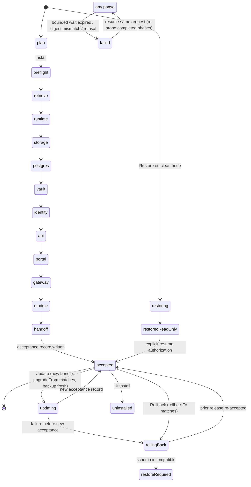

# CloudGrange product installer design (F12, Wave 4)

**Status:** authoritative implementation design for F12-1 (Story AB#8129, Tasks 9015–9018), the installer-side contract for F12-4 (AB#8130, Tasks 9019–9021) and M0-compact-restore (AB#8893, Tasks 9032–9034). Written 2026-09-12 for the Wave 4 implementation agents. It adds no ADO scope and closes nothing; ADO remains the status authority.

**Governing inputs (read at these revisions):** cloudgrange-internal `b47ddb8` (`m0-m1-implementation-plan.md` §4 Wave 4 and §5, `m0-task-register.md`, `compact-runtime-qualification.md`, `m0-signing-authority.md` CG-015, `foundation-architecture.md`); cloudgrange-platform-workflows `979dd01` (`docs/signing-design.md`, `docs/composition-content.md`, `docs/release-evidence-contract.md`, `schemas/*`); cloudgrange-infrastructure `0341909` (`schemas/compact-topology-v1.schema.json`, `docs/compact-management-contract.md`); this repository `eb7cf90` (`experiments/compact-rke2/*`, `teardown-and-promotion.md`); edge audit 2026-09-12 (installer section).

**Owner decisions applied:** the lab only receives published releases (§2 rule 1); `cglab-mgmt01` is reset to clean Ubuntu before the M0 release is installed, so there is **no adoption path** for the frozen experiment (§1a.3); one active Story per repository (§1a.1).

---

## 0. What exists, what this design builds, what is deferred

| Exists today (reusable) | Built by this design | Deferred (named, not silent) |
|---|---|---|
| `experiments/compact-rke2/Invoke-CompactRke2Experiment.ps1`: root PS7 on Ubuntu 24.04, SHA-256 of pinned RKE2 tarballs before extraction, request-identity checkpoint, foreign-runtime refusal, bounded readiness wait (qualified in pipelines 976–999) | The product installer under `installer/`: 12 phases, atomic hash-chained checkpoints, resume/refusal rules, evidence, modes Plan/Install/Verify/Update/Rollback/Restore/Uninstall | HA and multi-node profiles; Bundled and Appliance packaging (BOM schema already supports them); arm64 |
| `CloudGrange.ReleaseTrust` library (platform-workflows): strict JWS/ES256 verifier, policy/catalog history, composition byte closure (fixture-size bounds) | `cg-trust` self-contained CLI host and an operational large-artifact profile (cross-repo work package, §11) | Public Sigstore/attestations; TUF; Authenticode; MSI for the agent; agent self-update |
| Infrastructure `compact-topology-v1` schema and `Test-CompactPrerequisite.ps1` predicate (Pester-qualified) | Site config `cg-site-config-v1` (F12-4 owner: infrastructure) embedding the topology, plus installer-owned observation probe | Enterprise OIDC federation at install time (Keycloak local realm only in M0) |
| Component Dockerfiles for api, portal, relay; agent `Install-Agent.ps1` (sc.exe, shared-token enrollment) | Per-component Helm charts in this repo; GHCR names `ghcr.io/cloudgrange/<component>`; agent release package with `install`/`enroll` verbs (agent repo) | PITR/WAL backup (logical dump set first, per 8892 decision); certificate-rotation mode |
| Legacy compose-era `Install-/Update-/Uninstall-CloudGrange.ps1` at repo root | Archived under `archive/2026-09-12/` in the first work package; they are not part of the product | Air-gap certification (Online cached resume only, per qualification 986) |

Nothing in this document claims a passing runtime test. Every "must" below is an acceptance obligation for the named work package.

---

## 1. Customer journey

Persona: "Grange Farms IT" (plan §5). No repository access; only the GitHub Release page, published docs, a site config written from the published schema, and their own credentials.

### 1.1 What is downloaded

All customer-facing assets are attached to one GitHub Release on `CloudGrange/cloudgrange-deployment-installer`, tag `v<version>` (first candidate `v0.1.0-m0.rc1`). Names are exact; `<ver>` is the product version without the `v`.

| Asset | Content | Who uses it |
|---|---|---|
| `cloudgrange-install-<ver>-linux-x64.tar.gz` | The **install bundle** (layout in §1.2): installer scripts, `cg-trust` verifier, trust checkpoint, release BOM, composition manifest, catalog/policy/candidate envelopes, evidence inventory, charts, schemas, example site config, docs | Management node |
| `cloudgrange-release-bom-<ver>.json` | Copy of the BOM inside the bundle (`cg-release-bom-v1`, §2) | Auditors, the lab harness |
| `cloudgrange-proof-<ver>.zip` | Copy of `release/` from the bundle: `catalog.jws`, `policy/*.jws`, `candidates/*.jws`, `composition-manifest.json`, `evidence/*` | Auditors, Windows hosts |
| `cloudgrange-agent-<ver>-win-x64.zip` | Agent package (§6); original bytes re-attached by the publisher after digest readback | Hyper-V hosts |
| `cloudgrange-module-example-<ver>.cgmod` | Signed reference module package (F08-1 format) | Installer (module phase); operators reinstalling |
| `cg-trust-<ver>-win-x64.zip` | Verifier for optional offline verification on Windows | Hyper-V hosts (optional) |
| `trust-checkpoint-m0-internal.json` | Copy of the trust checkpoint inside the bundle | Convenience only; authority comes from §1.3 |
| `SHA256SUMS` | Digest of every asset above | Transport-corruption check only |
| `release-notes-<ver>.md` | Versioned notes, support-end date, known limits | Everyone |

Large vendor artifacts (RKE2 runtime tarball ~41 MB, RKE2 image archive ~801 MB) and all container images are **not** release assets; they are retrieved by exact digest during the retrieve phase (§4). The Bundled profile (deferred) transports the same members in a second tarball without changing the BOM.

### 1.2 Install bundle layout

```
cloudgrange-install-<ver>-linux-x64/
  Install-CloudGrange.ps1                 single entry point (all modes)
  modules/CloudGrange.Installer/          phase engine, checkpoint, retrieval, evidence
  bin/cg-trust                            self-contained linux-x64 verifier (platform-workflows)
  trust/checkpoint-m0-internal.json       owner-authenticated trust checkpoint (root SPKI, floors)
  release/release-bom.json                cg-release-bom-v1
  release/composition-manifest.json       cg-composition-v1
  release/catalog.jws                     cg-catalog-v1 (admission role)
  release/policy/<sequence>.jws           cg-policy-v1 chain needed for catch-up
  release/candidates/<artifactSha256>.jws cg-candidate-v1, one per member
  release/evidence/                       composition qualification, producer evidence files
  charts/<name>-<chartVersion>.tgz        first-party and curated vendor charts
  schemas/site-config-v1.schema.json      cg-site-config-v1 (infrastructure, F12-4)
  schemas/release-bom.schema.json
  schemas/install-checkpoint-v1.schema.json
  examples/site.example.json
  docs/                                   install, trust, enrollment, update, restore, uninstall
  SHA256SUMS
```

### 1.3 Offline verification (what the customer checks, in order)

1. **Independent channel first.** The product website (`cloudgrange.cloud/trust`, Cloudflare-hosted, not GitHub) publishes for each release: the SHA-256 of `cloudgrange-install-<ver>-linux-x64.tar.gz`, the `m0-internal` root key fingerprint (`sha256:<hex>` of the DER SPKI) and the trust-checkpoint SHA-256. For the lab, the same three values are in the owner's vault record. The customer compares the downloaded bundle's SHA-256 to that value before extracting. A bundle that authenticates itself is not accepted (CG-015 "unbootstrapped" rule).
2. **Verifier and trust root come from the authenticated bundle.** `bin/cg-trust` and `trust/checkpoint-m0-internal.json` are covered by step 1.
3. **`Install-CloudGrange.ps1 -Mode Plan`** runs `cg-trust verify-composition` with the checkpoint, `release/`, and the bundle's small files. Verification order is fixed: checkpoint floors → policy chain (catch-up allowed, terminal must be fresh) → catalog (admission role, `catalogSequence` ≥ floor) → composition manifest bytes (`compositionSha256`) → BOM bytes (`bomSha256`), configuration schema bytes (`configurationSchemaSha256`), qualification bytes → every candidate envelope against its catalog member pair → every small artifact and evidence file by exact digest and size. Signature format is CG-015: compact JWS, `alg=ES256`, `kid=sha256:<SPKI digest>`, 64-byte R||S signature, closed schemas, 300 s skew, 30-day validity, revocation sets.
4. **Large artifacts** (files above the 16 MiB fixture bound: RKE2 archives, image tarballs, agent package) are verified by the installer with streaming SHA-256 against the digests in the *already verified* manifest and BOM, immediately after retrieval and again immediately before each use. `cg-trust` gains an operational profile that reports these members as `digest-only` instead of loading them (§11, WP-03).
5. **Result** is written as `evidence/<installId>/trust-verification.json` with reason codes; any denial stops before any mutation and preserves the bundle.

### 1.4 Prerequisites the customer provides

| Requirement | Detail |
|---|---|
| Management VM | Clean Ubuntu 24.04 LTS x86_64 (dated Canonical image per `compact-runtime-qualification.md`), 8 vCPU / 32 GiB, 200 GiB system disk, separate ext4 data disk ≥ 256 GiB mounted at `/var/lib/rancher` (`compact-topology-v1` constants), systemd, iptables, NTP synchronized |
| PowerShell 7 | Installed from Microsoft's apt repository per vendor docs; the installer refuses versions below `compatibility.installer.powershellMinimum` and records the exact version. Bundling PS7 is deferred to the Bundled profile |
| DNS | Two names resolving to the published address: `<endpoint_dns_name>` (operators, portal, API, Keycloak) and `<device_endpoint_dns_name>` (default `devices.<endpoint_dns_name>`, agents; §5.5). In the lab both are lab-tooling records |
| TLS | Either a customer certificate and key for both names (`tls.mode: customer-provided`) or `tls.mode: internal-ca` (installer creates a site CA the customer must distribute) |
| Escrow key | An RSA-4096 public key (PEM) whose private key is kept **off** the node. The installer encrypts OpenBao recovery material, the backup encryption key and (internal-ca mode) the site CA key to it (§3.4 phase 6). Generation is documented (`openssl genpkey`); the fingerprint is written into the site config |
| Backup destination | Independently operated HTTPS endpoint and credential reference (topology `storage.backup`); required for update and restore, optional for first install with an explicit `backup.defer_until_setup: true` that the portal surfaces as a blocking warning |
| Registry access | Public GHCR for the first release; a credential reference is accepted for private packages (§4.2) |
| Hyper-V hosts | Windows Server 2025, local administrator, outbound TCP 443 to `<device_endpoint_dns_name>` |

### 1.5 The single entry command

```bash
sudo pwsh ./Install-CloudGrange.ps1 -Mode Install -SiteConfig /etc/cloudgrange/site.json
```

`-Mode Plan` performs every check and no mutation; `Verify` re-probes an installed system; `Update`, `Rollback`, `Restore`, `Uninstall` are §3.3. All modes take the same `-SiteConfig`. There is no other script for the customer to run on the management node.

### 1.6 The site config file (`cg-site-config-v1`)

Owned by F12-4 (infrastructure, 9019–9021) and embedded in the bundle by digest (`configurationSchemaSha256`). The installer validates it with the bundled schema and refuses unknown versions before any target write (9021). Field set this design requires:

| Section | Fields | Notes |
|---|---|---|
| `schema_version`, `profile` | `1`, `Compact` | Closed |
| `topology` | The existing `compact-topology-v1` object verbatim (host, node, network incl. `required_flows` and optional `publication`, storage incl. `backup`, trust CA bundle, proxy, recovery) | Reused, not duplicated |
| `release` | `channel` (`m0-internal`), `artifact_source` (`github` \| `mirror`), `mirror_base_uri` (optional https), `registry_credential_ref` (optional), `cache_root` (default `/var/lib/rancher/cloudgrange/cache`) | No `latest`, no tags |
| `platform` | `endpoint_dns_name` (from topology), `device_endpoint_dns_name`, `organization_display_name`, `timezone` | |
| `tls` | `mode` (`customer-provided` \| `internal-ca`), `certificate_ref`, `private_key_ref` (customer-provided only), `internal_ca_validity_days` | |
| `storage.volumes` | `postgres_gib`, `openbao_gib`, `blob_gib`, `gateway_gib` with defaults 60/5/100/5; preflight requires the sum plus cache headroom to fit the data disk | Static local PVs, §5.1 |
| `secrets` | `escrow.recipient_public_key_path`, `escrow.recipient_fingerprint_sha256`, `escrow.output_directory`, `seal.mode` (value set decided by F07-1; see phase 6) | Validated in preflight before any secret exists |
| `identity` | `realm` (`cloudgrange`), `admin_display_name`, `session_lifetime_minutes` | Local Keycloak only; federation deferred |
| `backup` | `defer_until_setup` (bool), `verify_freshness_hours` (default 24) | Rest is `topology.storage.backup` |
| `agent` | `enrollment_code_validity_minutes` (default 60) | Consumed by F05 contracts |

**Credential references.** The topology schema today accepts only `keyvault://` references, which is lab-shaped. 9019 must generalize to `secretref://file/<absolute path>` (root-only file, 0600), `secretref://env/<NAME>` and `secretref://keyvault/<vault>/<name>` (optional Azure). Secret values never appear in the site config, checkpoints, evidence or logs; the installer redacts by reference id.

### 1.7 What the customer sees at the end

The installer prints exactly once, and writes to `/var/lib/cloudgrange/state/setup-token` (root, 0600):

```
CloudGrange 0.1.0-m0.rc1 is installed and awaiting setup.
Open https://<endpoint_dns_name>/setup and enter the one-use setup token below.
Token: <64 hex>   Expires: <UTC>   Escrow file: <path>  (copy off this machine now)
```

Setup in the portal (F10-1) creates the first administrator through the API's guarded setup contract (8894), completes the production identity transition to the local Keycloak realm, and permanently disables setup. The installer's final phase only verifies that the API reports `awaiting-setup` with a token issued; it never sends an admin password.

---

## 2. Release BOM

### 2.1 Role in the trust chain

The BOM (`cg-release-bom-v1`) is an **evidence file**, not a JWS. It is signed by being bound: `bomSha256` appears in the `cg-composition-v1` manifest and in the `cg-catalog-v1` admission envelope, which Kristopher approves as an immutable payload (CG-015). The catalog's `members` array of `{artifactSha256, candidatePayloadSha256}` must equal the BOM's members one-to-one; each member's `provenance` must equal the `producer` fields of its authenticated candidate statement. The BOM never contains its own digest, the manifest digest or a catalog digest (acyclic order in `release-evidence-contract.md`).

Binding to source and CI: every member carries `provenance {repository, repositoryId, workflowPath, ref=refs/heads/main, sourceSha, runId, runAttempt}` copied from its candidate; the composition run itself is `assembly {…, compositionLockSha256}`; the composition qualification file (bound by `qualificationSha256`) records the assembly run and every member's evidence digests. Producer run IDs are GitHub Actions run IDs; signer run IDs live in the candidates, not the BOM.

### 2.2 Members of the M0 composition

Exact versions are selected by the curator and producer work packages and measured, not guessed here. Families and identities:

| id | kind | phase | name (digest-pinned at build) | Producer |
|---|---|---|---|---|
| `rke2-runtime` | vendor-archive | runtime | `rke2.linux-amd64.tar.gz` (v1.36.4+rke2r1, sha256 `7bcbd316…`) | Curator: this repo |
| `rke2-images` | vendor-archive | runtime | `rke2-images.linux-amd64.tar.zst` (sha256 `03b82bfa…`) | Curator: this repo |
| `cg-base` | helm-chart | storage | `charts/cg-base` | This repo |
| `cnpg-operator-chart` | vendor-helm-chart | postgres | `cloudnative-pg` upstream chart | Curator: this repo |
| `cnpg-operator-image` | vendor-oci-image | postgres | `ghcr.io/cloudgrange/vendor/cloudnative-pg@sha256:…` (mirrorOf upstream) | Curator |
| `postgresql-image` | vendor-oci-image | postgres | `ghcr.io/cloudgrange/vendor/postgresql@sha256:…` (PG 17.x CNPG image) | Curator |
| `cg-postgres` | helm-chart | postgres | `charts/cg-postgres` (CNPG `Cluster`, roles, databases) | This repo |
| `openbao-image` | vendor-oci-image | vault | `ghcr.io/cloudgrange/vendor/openbao@sha256:…` (version per F07-1) | Curator |
| `cg-openbao` | helm-chart | vault | `charts/cg-openbao` (config from F07-3 contract) | This repo |
| `keycloak-image` | vendor-oci-image | identity | `ghcr.io/cloudgrange/vendor/keycloak@sha256:…` (26.x) | Curator |
| `cg-keycloak` | helm-chart | identity | `charts/cg-keycloak` (realm template from F04-1) | This repo |
| `api-image` | oci-image | api | `ghcr.io/cloudgrange/api@sha256:…` (hosts Core and Identity) | platform-api |
| `cg-api` | helm-chart | api | `charts/cg-api` (migration Job + Deployment) | This repo |
| `portal-image` | oci-image | portal | `ghcr.io/cloudgrange/portal@sha256:…` | portal |
| `cg-portal` | helm-chart | portal | `charts/cg-portal` | This repo |
| `gateway-image` | oci-image | gateway | `ghcr.io/cloudgrange/gateway@sha256:…` (runtime-relay) | runtime-relay |
| `cg-gateway` | helm-chart | gateway | `charts/cg-gateway` | This repo |
| `module-example` | module-package | module | `cloudgrange-module-example-<ver>.cgmod` | module-example |
| `agent-package` | agent-package | handoff | `cloudgrange-agent-<ver>-win-x64.zip` | runtime-agent |
| `installer-archive` | installer-archive | preflight | `cloudgrange-installer-<ver>.zip` (scripts + modules only) | This repo |
| `cg-trust` | verifier | preflight | `cg-trust` linux-x64 self-contained | platform-workflows |
| `prerequisite-predicate` | script-archive | preflight | `cloudgrange-management-scripts-<ver>.zip` (`Test-CompactPrerequisite.ps1`, schemas) | infrastructure |

Not members: the BOM, manifest, catalog, policies, candidates, trust checkpoint, schemas, docs, `SHA256SUMS` (evidence or trust inputs, listed in the composition manifest with role `evidence` where applicable).

**Digest semantics.** For files, `sha256` is the file bytes. For OCI images and OCI-published charts, `sha256` is the manifest digest (hex, no prefix), which is what `name@sha256:` resolves. M0 builds `linux/amd64` only with buildx attestations disabled (`provenance: false`, `sbom: false`) so the pushed object is a single image manifest, not an attestation-bearing index; SBOM and provenance are detached evidence files per the release-evidence contract. Vendor images are mirrored to `ghcr.io/cloudgrange/vendor/<name>` with a digest-preserving copy; the BOM records both `reference` (mirror) and `mirrorOf` (upstream), and the curator evidence records the upstream checksum/signature observation.

### 2.3 Schema

`schemas/release-bom.schema.json` (this PR) is the closed structural schema: draft 2020-12, `additionalProperties: false` throughout, digest-pinned OCI references only, enumerated kinds and phases, `provenance` mirroring the candidate producer tuple, `assembly` for the composition run, and `compatibility` with `installer.powershellMinimum`, `verifier.minVersion`, `operatingSystems`, `kubernetes`, `postgresql.major`, `database {schemaVersion, minCompatibleReaderVersion}`, `agent`, `module`, `upgradeFrom[]` and `rollbackTo[]` (each `{version, bomSha256}`). PS7 `Test-Json` validates it; `cg-trust` validates it with its strict parser (duplicate names, exact integers, bounded strings).

Excerpt of one member as an implementer target:

```json
{
  "id": "api-image", "kind": "oci-image", "phase": "api",
  "name": "ghcr.io/cloudgrange/api", "version": "0.1.0-m0.rc1",
  "os": "linux", "architecture": "amd64",
  "sha256": "<manifest digest hex>", "sizeBytes": 123456789,
  "candidatePayloadSha256": "<hex>",
  "provenance": {"repository": "CloudGrange/cloudgrange-platform-api", "repositoryId": "<id>",
                 "workflowPath": ".github/workflows/release.yml", "ref": "refs/heads/main",
                 "sourceSha": "<40 hex>", "runId": "<id>", "runAttempt": 1},
  "retrieval": {"type": "oci", "reference": "ghcr.io/cloudgrange/api@sha256:<hex>"},
  "evidence": {"sbomSha256": "<hex>", "licenseNoticeSha256": "<hex>"},
  "dependsOn": ["postgresql-image", "openbao-image", "keycloak-image"]
}
```

### 2.4 Composition manifest and the large-artifact split

`cg-composition-v1` lists every artifact and evidence file with logical path, role, digest and size. The current `CompositionContentVerifier` bounds are fixture-sized (16 MiB per file, 64 MiB aggregate). The operational profile (WP-03) keeps those bounds for loaded content and adds `digest-only` members: the manifest still names the large file and its digest, the verifier proves the manifest/catalog/candidate closure, and the installer proves the bytes by streaming hash. Both results are recorded in the trust-verification evidence with the same manifest digest so the binding is auditable.

---

## 3. Installer state machine

### 3.1 On-node layout

| Path | Disk | Content |
|---|---|---|
| `/etc/cloudgrange/site.json` | system | Accepted site config copy (0600); its SHA-256 is part of the request identity |
| `/var/lib/cloudgrange/state/` | system | `checkpoint.json` (+ `.prev`, `.tmp`), `install.lock`, `trust/` (accepted-composition record, floors, last-good time), `releases/<version>/` (BOM, manifest, rendered values, chart digests), `setup-token`, `escrow/` (encrypted outputs awaiting pickup) |
| `/var/lib/cloudgrange/state/evidence/<installId>/<attempt>/<phase>/` | system | Redacted phase evidence (§3.5) |
| `/var/lib/rancher/cloudgrange/cache/sha256/<hex>` | data | Content-addressed offline cache (§4.3) |
| `/var/lib/rancher/cloudgrange/volumes/{postgres,openbao,blob,gateway}` | data | Static local PV backing directories |
| `/var/lib/rancher/rke2`, `/etc/rancher/rke2` | data / system | RKE2 as in the experiment (`data-dir: /var/lib/rancher/rke2`) |

### 3.2 Checkpoint contract (`cg-install-checkpoint-v1`)

```json
{
  "schema": "cg-install-checkpoint-v1",
  "installId": "<uuid, generated once on first Install>",
  "mode": "Install",
  "requestSha256": "<sha256(site.json bytes || release-bom.json bytes || installer-archive sha256)>",
  "bomSha256": "<hex>", "catalogPayloadSha256": "<hex>", "productVersion": "0.1.0-m0.rc1",
  "attempt": 3,
  "phase": "vault", "phaseState": "started",
  "phases": {
    "preflight": {"state": "completed", "startedUtc": "...", "completedUtc": "...", "outputsSha256": "<hex>"},
    "retrieve":  {"state": "completed", "...": "..."},
    "runtime":   {"state": "completed", "outputs": {"nodeUid": "...", "bootId": "..."}}
  },
  "updatedUtc": "...",
  "previousCheckpointSha256": "<hex of the prior checkpoint bytes>"
}
```

Rules, inherited and extended from the experiment:

- **Atomic write:** serialize → write `checkpoint.json.tmp` → `fsync` → rename over `checkpoint.json` (previous copy kept as `.prev`). Each checkpoint hashes its predecessor. On start, a `.tmp` leftover is deleted; a `checkpoint.json` whose `previousCheckpointSha256` does not match `.prev` is refused as corrupt with both files preserved.
- **One installer at a time:** `flock` on `install.lock`; a second invocation exits with `installer-already-running` and the holder's PID.
- **Request identity:** the checkpoint's `requestSha256` must equal the current inputs. A different site config or BOM is refused (`request-mismatch; existing installation preserved`) except in `Update`, `Rollback` and `Restore`, which validate the transition explicitly (§7).
- **Secrets never enter the checkpoint.** Outputs are identities, digests and paths.

### 3.3 Modes

| Mode | Effect | Terminal states |
|---|---|---|
| `Plan` | Trust verification, site config validation, preflight observations and predicate, retrieval dry-run (sizes, sources), no mutation | `plan-ok`, `plan-blocked` |
| `Install` | Phases 1–12 then durable acceptance; resumable | `accepted`, `failed:<phase>` |
| `Verify` | Re-runs every phase's postcondition probe against the accepted composition | `verified`, `drift:<phase>` |
| `Update` | §7.1; new bundle over an accepted composition | `accepted`, `failed:<phase>` with prior release retained |
| `Rollback` | §7.2; to the retained previous release | `accepted`, `rollback-requires-restore` |
| `Restore` | §7.3; clean node from recovery set | `restored-read-only`, `accepted`, `blocked:<reason>` |
| `Uninstall` | §3.7; retention levels | `uninstalled:<retention>` |

### 3.4 Phases

Order is fixed. For each phase: **pre** (preconditions), **do** (actions, idempotent), **probe** (postcondition re-checked on resume and in Verify), **checkpoint** (outputs recorded), **resume/rollback** rules, **evidence**. Bounded waits are explicit; expiry preserves state and fails with an attributable reason, never a retry loop.

#### Phase 1 `preflight`
- **pre:** root, PS7 ≥ minimum, bundle trust verified (§1.3).
- **do:** validate site config against the bundled schema (unknown version/contradictory settings → stop); run the installer-owned observation probe (OS/arch/hostname, CPU/memory, disk layout incl. `CGLABDATA`-style dedicated data disk check generalized to `dedicated_data_disk`, `ip -j`, `lsblk -J`, `timedatectl`, DNS resolution of both endpoint names, NTP, free space, required flow connectivity, backup endpoint authenticated access unless deferred); write `compact-observations-v1`; invoke the bundled `Test-CompactPrerequisite.ps1` with the topology section and the observations; parse the escrow public key, compute its SPKI SHA-256 and compare to `secrets.escrow.recipient_fingerprint_sha256`; validate registry credential reference resolves (without printing); **foreign-runtime guard:** if `/usr/local/bin/rke2`, `/var/lib/rancher/rke2/server` or `/etc/rancher/rke2/config.yaml` exists without a matching checkpoint → `existing-runtime-without-checkpoint; preserved` (identical to the experiment; this is how a non-reset `cglab-mgmt01` is refused).
- **probe:** predicate `passed=true` with the same topology digest.
- **checkpoint:** topology digest, observations digest, predicate result digest, escrow fingerprint, PS7 version, node identities (machine-id, boot-id, data volume UUID).
- **resume:** always re-run (cheap, read-only). **rollback:** none.
- **evidence:** observations, predicate blockers, redacted config diff.

#### Phase 2 `retrieve`
- **pre:** preflight completed; cache root exists on the data disk.
- **do:** for every BOM member in `dependsOn` order: if the cache holds `sha256/<hex>` with matching size and digest → reuse; else download by exact identity (§4) to `sha256/<hex>.partial`, stream-hash, compare size and digest, rename into place. Refuse redirects to other hosts than the allowlisted source hosts. Images are pulled by manifest digest and written as OCI-layout tarballs (§4.4).
- **probe:** every member present with matching digest (re-hash).
- **checkpoint:** `cache-index.json` digest (member id → cache path, digest, size, source, verifiedUtc).
- **resume:** per-member; partial files are discarded. Egress denial after a complete cache resumes without network (qualified pattern from run 986). **rollback:** none; cache is retained across failures.
- **evidence:** per-member source, bytes, elapsed, HTTP status codes; never tokens or URLs with credentials.

#### Phase 3 `runtime` (RKE2)
- **pre:** retrieve completed; foreign-runtime guard still true.
- **do:** promote the experiment engine: tar member allowlist check → extract to `/usr/local` (skip if the installed binary already has the BOM digest) → write `/etc/rancher/rke2/config.yaml` from the site config (node name/ip, `tls-san` incl. both endpoint names, canal, traefik, CIDRs, `write-kubeconfig-mode: 0600`) → stage `rke2-images` **and every product/vendor image tarball** into `/var/lib/rancher/rke2/agent/images/` (re-hash before copy) → write `HelmChartConfig` for `rke2-traefik` into `/var/lib/rancher/rke2/server/manifests/` (websecure only: `ports.web.expose: false`; `providers.kubernetesCRD.allowCrossNamespace: false`; default `TLSOption` minimum TLS 1.2) → `systemctl daemon-reload`, `enable`, `start --no-block rke2-server` → wait for `/readyz` and the single node `Ready` (20 min) → wait for Canal and Traefik `HelmChart` `Failed=False` and the image imports to appear in `crictl images` for every staged reference (10 min).
- **probe:** node Ready, binary digest, config bytes identical, all staged image references present.
- **checkpoint:** `runtime_prepared` → `runtime_start_requested` → `node_ready` (kept as sub-states for interruption evidence), node UID, boot ID, RKE2 version output.
- **resume:** on `runtime_start_requested` re-enter the wait (qualified in run 989). **rollback:** none automatic; the runtime is retained for inspection. Only `Uninstall` removes it.
- **evidence:** `nodes.json`, `pods.json`, `charts.json`, `crictl images` listing, `journalctl -u rke2-server` tail (bounded).

#### Phase 4 `storage`
- **pre:** node Ready.
- **do:** apply `cg-base` via a `HelmChart` CR with `chartContent` (§5.6): namespaces `cloudgrange-system`, `cloudgrange`; `StorageClass cloudgrange-local` (`kubernetes.io/no-provisioner`, `WaitForFirstConsumer`); static `local` PersistentVolumes for postgres/openbao/blob/gateway with declared sizes, `nodeAffinity` to the node, labels `cloudgrange.cloud/volume=<name>`, backing directories created 0700; default-deny `NetworkPolicy` in `cloudgrange` plus explicit allows (ingress from Traefik namespace, api→postgres, api→openbao, api→keycloak, gateway→api, keycloak→postgres, DNS egress); `ConfigMap cg-ca-bundle` from `topology.trust.ca_bundle_path`; `ServiceAccount cloudgrange-installer` with the minimum RBAC the later phases use; TLS: customer-provided → `Secret cg-endpoint-tls` from the references; internal-ca → generate site CA (P-256, `internal_ca_validity_days`) and one leaf covering both names, write `cg-endpoint-tls`, keep the CA key in `Secret cg-site-ca-bootstrap` (removed in phase 6 after import into OpenBao PKI) and add the CA to `cg-ca-bundle`; `TLSStore default` → `cg-endpoint-tls`.
- **probe:** HelmChart succeeded; PVs `Available`/`Bound`; TLS secret matches the certificate digest; policies present.
- **checkpoint:** chart digest, PV names and sizes, certificate SHA-256 and expiry, CA SHA-256.
- **resume/rollback:** re-apply is idempotent; nothing to undo.
- **evidence:** rendered values (redacted), `kubectl get pv,sc,networkpolicy -o json`.

#### Phase 5 `postgres` (CloudNativePG operator + PG 17 cluster)
- **pre:** storage completed.
- **do:** `HelmChart` for the curated `cloudnative-pg` operator chart (operator image by digest) in `cloudgrange-system`; wait operator Ready (10 min). Generate role passwords (`cg_migrate`, `cg_runtime`, `cg_audit_export`, `keycloak`) → `Secrets` in `cloudgrange` (kept as the bootstrap copy; mirrored into OpenBao in phase 6). `HelmChart cg-postgres`: CNPG `Cluster cg-postgres` with `instances: 1`, PG 17 image by digest, `storage.pvcTemplate` selecting the `postgres` PV, `enableSuperuserAccess: false`, `bootstrap.initdb` creating databases `cloudgrange` (owner `cg_migrate`) and `keycloak` (owner `keycloak`), `managed.roles` with `passwordSecret` for the four roles, `postgresql.parameters` from the F09-1 baseline, backup section from the 8892 contract (or omitted when `backup.defer_until_setup`). Wait `Cluster` phase `Cluster in healthy state` (10 min).
- **probe:** cluster healthy, `cg-postgres-rw` service resolves, role login for `cg_migrate` succeeds via a short-lived `psql` Job.
- **checkpoint:** operator chart digest, cluster CR digest, database and role names (not passwords), PG server version string.
- **resume:** CR re-apply is idempotent; if the cluster exists with a different image digest → `postgres-image-mismatch; preserved` (Update is the only path that changes it). **rollback:** none; data volume retained.
- **evidence:** operator and cluster status, CNPG `Backup`/`ScheduledBackup` status if configured.

#### Phase 6 `vault` (OpenBao init and escrow handoff)
- **pre:** postgres completed; escrow recipient validated in preflight.
- **do:** `HelmChart cg-openbao` (single replica, integrated storage on the `openbao` PV, listener TLS with a leaf from the site CA or customer cert, configuration file generated from the F07-3 contract; seal stanza per `secrets.seal.mode`, a value set fixed by F07-1's decision 8961/8962). Wait pod Running and `/v1/sys/health` answering `not initialized` (5 min).
  **Init crash-window rule (non-idempotent step):**
  1. write checkpoint `vault: init_requested`;
  2. `PUT /v1/sys/init` (shamir: `secret_shares=5, secret_threshold=3`; other seal modes per F07-1) — the response is held in memory only;
  3. encrypt the response as `cg-escrow-v1` (RSA-4096 OAEP-SHA256 wrapping a random AES-256-GCM key; payload: init material, seal material where applicable, timestamps, installId, recipient fingerprint) → write `escrow/openbao-<installId>-<utc>.escrow`, `fsync`;
  4. write checkpoint `vault: initialized` with the escrow file SHA-256.
  On resume: if OpenBao reports `initialized=true` and no `initialized` checkpoint exists **and** no `secrets_written` checkpoint exists, the vault holds nothing yet; the installer stops the pod, clears the `openbao` PV directory, restarts and re-runs init (recorded as `vault-reinitialized-after-crash`). If `secrets_written` exists the installer refuses (`vault-initialized-escrow-missing`) and points to the escrow file or the restore path.
  Then: unseal with in-memory shares (or per seal mode) → enable KV v2 at `cloudgrange/` → enable Kubernetes auth with roles `cloudgrange-api`, `cloudgrange-gateway` bound to their ServiceAccounts and least-privilege policies → enable PKI at `pki-devices` and generate the **site device CA** inside OpenBao (key never leaves; offered to F05-2 for agent certificate issuance) → internal-ca mode: import the site CA key into a second PKI mount `pki-site` and delete `cg-site-ca-bootstrap` → write generated secrets: `cloudgrange/platform/db/{migrate,runtime,audit_export}`, `cloudgrange/platform/keycloak/{db,bootstrap-admin}`, `cloudgrange/platform/oidc/client` (generated now, consumed in phase 7), `cloudgrange/platform/backup/encryption-key` (256-bit, also escrowed) → checkpoint `secrets_written` → revoke the initial root token (`POST /v1/auth/token/revoke-self`); later installer operations authenticate through Kubernetes auth as `cloudgrange-installer` with an `installer` policy.
- **probe:** `sealed=false`, `initialized=true`, KV mount present, PKI CA present, installer login works.
- **checkpoint:** `init_requested` → `initialized` (escrow SHA-256, path) → `secrets_written` → `root_revoked`; chart digest; seal mode; device CA fingerprint.
- **resume:** by sub-state as above. **rollback:** none; the data volume and escrow file are retained. **Operator obligation:** copy the escrow file off the node; the final report repeats the path and SHA-256 until Verify sees `escrow.acknowledged=true` set via `-AcknowledgeEscrow <sha256>`.
- **evidence:** health, mounts, auth roles, PKI CA certificate (public), escrow file digest; never shares, tokens or keys.

#### Phase 7 `identity` (Keycloak)
- **pre:** vault completed.
- **do:** `HelmChart cg-keycloak`: single replica, Keycloak 26.x image by digest, `start --optimized` with DB=postgres (`cg-postgres-rw`, `keycloak` role secret), `KC_HTTP_RELATIVE_PATH=/auth`, `KC_HOSTNAME=https://<endpoint_dns_name>/auth`, `KC_HTTP_ENABLED=true` behind Traefik with `KC_PROXY_HEADERS=xforwarded`, bootstrap admin from `Secret cg-keycloak-bootstrap-admin` (value mirrored in OpenBao), realm import from a `ConfigMap` rendered from the versioned realm template (starting point: this repo's `compose/keycloak/cloudgrange-realm.json`, semantics owned by F04-1): realm `cloudgrange`, confidential client `cloudgrange-api` (secret from `cloudgrange/platform/oidc/client`), public PKCE client `cloudgrange-portal`, roles per F04-2. `IngressRoute` `/auth` → keycloak. Wait `/auth/realms/cloudgrange/.well-known/openid-configuration` over the public endpoint through Traefik with the CA bundle (10 min).
- **probe:** discovery document issuer equals the configured issuer; realm and both clients exist.
- **checkpoint:** chart digest, realm template digest, issuer URL, client ids (no secrets).
- **resume:** re-apply; Keycloak `--import-realm` skips existing realms, so partial imports are corrected by the phase's explicit realm/client reconciliation through the admin API. **rollback:** none.
- **evidence:** discovery document, realm export minus secrets.

#### Phase 8 `api` (API/Core migrations, then API)
- **pre:** identity completed.
- **do:** create `Secret cg-setup-token` containing only `tokenSha256` and `expiresAt` (plaintext token generated here, 32 random bytes hex, held for phase 12). `HelmChart cg-api` renders **two** objects sequentially: (a) `Job cg-api-migrate-<schemaVersion>` running the API image with the migration entrypoint (`CloudGrange.Api migrate` using the `cg_migrate` credential resolved from OpenBao; exclusive migration lock per F09-1; `backoffLimit: 0`; `ttlSecondsAfterFinished` unset so evidence survives) — the installer waits for `Succeeded` (15 min) before (b) the `Deployment cg-api` (1 replica; env: OpenBao address and Kubernetes auth role, OIDC issuer, DB host, blob volume mount at `/var/lib/cloudgrange/blob` on the `blob` PV, setup-token secret mount) with readiness `/health/ready` and `IngressRoute` `/api` (higher priority than `/`). Wait Ready (10 min).
- **probe:** migration Job succeeded with the BOM `database.schemaVersion`; `/health/ready` OK through Traefik; `/api/v1/setup/status` reports `awaiting-setup`.
- **checkpoint:** chart digest, image digest, schema version applied, migration Job name and completion time, token expiry (not the token).
- **resume:** a completed migration Job for the same schema version is not re-run; a failed one blocks with `migration-failed` and the Job logs retained (Update/Rollback rules in §7). **rollback:** the Deployment can be scaled to 0; schema is never rolled back automatically.
- **evidence:** migration Job log (bounded, redacted), readiness responses.

#### Phase 9 `portal`
- **do:** `HelmChart cg-portal` (image by digest, runtime config with API base `/api` and issuer), `IngressRoute` `/` at lowest priority. Wait Ready (5 min). **probe:** `GET /` 200 and `/setup` route served. **checkpoint:** chart and image digests. Idempotent re-apply.

#### Phase 10 `gateway`
- **do:** `HelmChart cg-gateway` (image by digest; `Service` 8443; identity volume on the `gateway` PV; control connection to the API in-cluster per F05-2; server certificate for `<device_endpoint_dns_name>` issued from `pki-devices` or the customer cert per F05-2's decision), `IngressRouteTCP` on `websecure` with `HostSNI(<device_endpoint_dns_name>)` and `tls.passthrough: true` so the gateway terminates mTLS itself. Wait Ready and a TLS handshake to `<device_endpoint_dns_name>:443` presenting the expected certificate (5 min). **probe:** SNI handshake OK, API reports the gateway registered. **checkpoint:** chart/image digests, server certificate SHA-256, device CA fingerprint.

#### Phase 11 `module`
- **do:** upload `module-example` bytes to the API package endpoint (F08-3) using the installer's short-lived service credential issued for bootstrap operations by 8894/F04-3; submit the lifecycle install job; wait for `installed-disabled` then `enabled` (10 min). Signature verification of the package is the API's (F08-1/F08-2) and is not bypassed by the installer's prior digest check. **probe:** module status `enabled` for the exact package digest. **checkpoint:** package digest, lifecycle job id. **resume:** idempotent by package digest (duplicate submission returns the original job).

#### Phase 12 `handoff` (one-use setup token) and acceptance
- **do:** confirm `GET /api/v1/setup/status` → `{state: awaiting-setup, tokenIssued: true, expiresAt}`; write `/var/lib/cloudgrange/state/setup-token` (0600); print the §1.7 message once. Then **durable acceptance**: write `trust/accepted-composition.json` (catalog sequence and payload digest, BOM digest, manifest digest, installId, acceptance time, verifier version) and update `trust/floors.json` atomically (rename), then checkpoint `accepted`. Activation of nothing waits on this write (all components are already running), but `Verify`, `Update`, `Rollback` and `Restore` refuse to treat the composition as accepted until it exists (CG-015 "no activation before durable accepted-state commit" is satisfied by treating pre-acceptance as an unfinished install).
- **probe:** acceptance record digest matches; the setup token file is deleted once the API reports setup completed or the token expired.
- **evidence:** `install-result.json` (product version, BOM/catalog digests, per-phase timings, `accepted: true`).

### 3.5 Failure evidence (all phases)

Every phase failure writes `phase-result.json` (`phase`, `subState`, `reasonCode`, `attempt`, `startedUtc`, `failedUtc`, digests of inputs, bounded native output) plus the phase's listed artifacts. Reason codes are stable strings (`request-mismatch`, `artifact-digest-mismatch`, `readiness-timeout`, `vault-initialized-escrow-missing`, …) reused by the lab harness and the docs. Secrets, kubeconfig contents, tokens and shares are never written; a redaction canary test injects known values and asserts absence.

### 3.6 The existing experimental install on `cglab-mgmt01`

The owner decided to reset the VM to clean Ubuntu (lab tooling `Reset-LabManagementNode`, internal/lab, with a separate confirmation immediately before it runs). Therefore the product installer has **no adoption or migration path** for the frozen `8819c5f` experiment: it keeps the experiment's refusal (`existing-runtime-without-checkpoint`) and never rewrites another checkpoint's request identity. Retention checks in `teardown-and-promotion.md` (evidence export, exact VM identity, preserved disks) are executed by the orchestrator before the reset and are outside product code.

### 3.7 Uninstall and retention (9018)

`Install-CloudGrange.ps1 -Mode Uninstall -SiteConfig … -Retain <level>`:

| Level | Removes | Retains | Guards |
|---|---|---|---|
| `Workloads` | CloudGrange `HelmChart` objects in dependency-reverse order (module → gateway → portal → api → keycloak → openbao → postgres → base) | RKE2, all data volumes, cache, state, escrow | Confirmation prompt (`-Force` for automation) |
| `Runtime` (default) | Workloads, then RKE2 through the vendor `rke2-uninstall.sh` (documented vendor interface; removes `/var/lib/rancher/rke2`, `/etc/rancher`, `/usr/local/bin/rke2*`) | `/var/lib/rancher/cloudgrange/{volumes,cache}`, `/var/lib/cloudgrange/state` including trust record and escrow | Same |
| `Purge` | Everything above plus volumes, cache, state | Nothing on the node except `uninstall-receipt.json` written to `-ReceiptPath` (must be outside the purged trees) | Requires `-ConfirmPurge <installId>` typed literally |

Before removing workloads the installer, if the API is reachable, requests revocation of all device credentials and disables modules so agents fail closed; this is best-effort and the receipt records whether it happened. Agents remain installed on hosts and are removed per host (§6). Secrets in the retained OpenBao volume stay sealed; the escrow material remains the only way to open it. The receipt lists retained paths with digests of their manifests so a later `Restore`/`Install` can prove what was kept.

### 3.8 State diagram



---

## 4. Artifact retrieval

### 4.1 Sources, exact identity only

| Member kind | Source | Identity used |
|---|---|---|
| `vendor-archive` (RKE2) | `https://github.com/rancher/rke2/releases/download/<tag>/<file>` | URL from BOM `retrieval.https.uri` + `sha256` + `sizeBytes` |
| `oci-image`, `vendor-oci-image` | `ghcr.io/cloudgrange/...@sha256:<digest>` (vendor mirrors under `ghcr.io/cloudgrange/vendor/`) | Manifest digest; every blob verified by its own digest |
| `helm-chart`, `vendor-helm-chart` | Bundled in `charts/`; also published as OCI at `ghcr.io/cloudgrange/charts/<name>@sha256:` | File SHA-256 (equals the OCI layer digest) |
| `agent-package`, `module-package`, `installer-archive`, `script-archive`, `verifier` | Release assets or bundled | File SHA-256 |

`release.artifact_source: mirror` with `mirror_base_uri` substitutes the host for `https` and release-asset retrievals and the registry host for OCI; identities are unchanged, so a mirror cannot substitute content. No tag, `latest`, branch or floating reference exists anywhere in the BOM or the installer; the schema forbids them.

### 4.2 Authentication

- GitHub Release assets and public GHCR need no credential.
- Private packages: `release.registry_credential_ref` (`secretref://file/...` or `env`) supplies a token used as a `Bearer` for GHCR's token endpoint and as `Authorization: token` for `api.github.com` asset downloads. The value is read once into memory, never logged, never written to the cache index.
- Proxy: `topology.proxy` (explicit mode) applies to all retrievals; the CA bundle is used for TLS validation; certificate validation is never disabled.

### 4.3 Offline cache

Content-addressed: `/var/lib/rancher/cloudgrange/cache/sha256/<hex>` plus `cache-index.json` (member id, digest, size, source, verifiedUtc, `lastUsedBy` release). A file is trusted only after a full re-hash at the moment of use. `Plan` reports cache hits and the bytes still to download. The cache is shared across releases (an Update reuses unchanged members) and is pruned only by `-Mode Uninstall -Retain Purge` or an explicit `-PruneCache` that keeps members referenced by the accepted and previous release. A Bundled profile pre-populates the same cache from a second tarball; the installer code path is identical.

### 4.4 Pulling images by digest without extra binaries

The installer implements the OCI distribution pull in PS7 (`Get-CgOciImage`): `GET /v2/<name>/manifests/sha256:<digest>` with `Accept` for OCI and Docker v2 manifest types (an index is refused for `oci-image` members because the BOM pins single-platform manifests), verify the manifest bytes hash to the digest, `GET` config and each layer by digest, verify each, write an OCI image layout (`oci-layout`, `index.json` with `org.opencontainers.image.ref.name = <name>@sha256:<digest>`, `blobs/sha256/*`) and tar it deterministically into the cache. Staging into `/var/lib/rancher/rke2/agent/images/` before `rke2-server` starts makes containerd import them at first start; during `Update` (containerd running) the installer imports with `/var/lib/rancher/rke2/bin/ctr -n k8s.io images import` and verifies with `crictl images --digests`. Charts reference images only as `<name>@sha256:<digest>` with `imagePullPolicy: IfNotPresent`, so a running system never contacts a registry for an accepted composition; a missing import fails readiness rather than silently pulling.

---

## 5. Packaging of components

### 5.1 Per-component charts, no umbrella

Decision: **one chart per phase-owned component** (`cg-base`, `cg-postgres`, `cg-openbao`, `cg-keycloak`, `cg-api`, `cg-portal`, `cg-gateway`) plus the curated upstream `cloudnative-pg` operator chart. Reasons: each phase checkpoints, probes and rolls back its own chart; RKE2's helm-controller reconciles each `HelmChart` CR independently, so a failed portal upgrade does not touch PostgreSQL; and the catalog member set is one entry per chart. An umbrella chart would couple lifecycle and hide which member changed. Charts live in `charts/<name>/` in this repository, are linted (`helm lint`, `kubeconform` against the pinned Kubernetes version) in CI and packaged with a `chartVersion` equal to the product version.

Vendor operators with a maintained upstream chart (CloudNativePG) are curated as `vendor-helm-chart` members rather than re-authored; Keycloak has no vendor chart and OpenBao's configuration is owned by F07-3, so both are first-party charts wrapping digest-pinned vendor images.

### 5.2 Values are generated, never hand-edited

`installer/modules/CloudGrange.Installer/Values/<chart>.ps1` renders `values.yaml` for each chart from the validated site config, the BOM (image digests), and phase outputs (service names, certificate digests). Rendered values are written under `state/releases/<version>/values/<chart>.yaml` with secrets replaced by references, and their digest goes into the checkpoint. Charts have no defaults that could stand in for a missing site value; every image reference is required and validated to be digest-pinned by a chart-level `fail` template helper. Editing values or containers by hand after install is outside the supported product (plan §5), and `Verify` reports drift.

### 5.3 Secrets: OpenBao is the system of record

First-party components (API/Core, gateway) resolve secrets from OpenBao through Kubernetes auth and the F07-2 reference contract; no secret values are placed in their environment. Vendor components that cannot speak OpenBao (CNPG role passwords, Keycloak DB and bootstrap admin) consume Kubernetes `Secrets` that the installer generates and mirrors into OpenBao paths; the mirror is the authority for restore (§7.3). Generated values are 32 random bytes; nothing is derived from the site config. The setup token is a one-way hash in a Secret (§3.4 phase 8).

### 5.4 Ingress: Traefik on 443 only

RKE2's bundled Traefik is the only ingress. `HelmChartConfig` disables the `web` (80) entrypoint exposure; the `websecure` entrypoint serves everything:

| Route | Object | Target |
|---|---|---|
| `Host(<endpoint>) && PathPrefix(/api)` | `IngressRoute` | `cg-api:8080` |
| `Host(<endpoint>) && PathPrefix(/auth)` | `IngressRoute` | `cg-keycloak:8080` |
| `Host(<endpoint>)` (lowest priority) | `IngressRoute` | `cg-portal:80` |
| `HostSNI(<device_endpoint>)`, passthrough | `IngressRouteTCP` | `cg-gateway:8443` (gateway terminates mTLS, F05-2) |

`TLSStore default` holds the endpoint certificate; `TLSOption default` sets minimum TLS 1.2 and the F04 cipher policy. The Kubernetes API (6443/9345), etcd and CNI ports remain unexposed (qualification record, management contract).

### 5.5 Applying charts through the helm-controller

Each chart is applied as a `helm.cattle.io/v1 HelmChart` in `kube-system` (the controller's namespace) with `spec.chartContent` (base64 of the verified `.tgz`), `spec.valuesContent`, `spec.targetNamespace` and `spec.version` = product version. This is the mechanism RKE2 already used for Canal and Traefik in the qualified experiment, needs no helm binary, and gives a `HelmChart` status the installer polls (`Failed`, `JobName`). Upgrade and rollback re-apply the CR with the other release's content; the controller runs `helm upgrade --install`. The chart job image (`klipper-helm`) is part of the RKE2 image archive already pinned.

---

## 6. Agent install on Hyper-V hosts

### 6.1 Released package

`cloudgrange-agent-<ver>-win-x64.zip` (BOM member `agent-package`, produced by `cloudgrange-runtime-agent`): `CloudGrange.Runner.exe` (self-contained win-x64, net10.0), `agent-manifest.json` (file digests, version, minimum gateway version), `NOTICE`/`LICENSE`, `Install-CloudGrangeAgent.ps1` (PS7 wrapper, optional). The MSI remains deferred; the zip's digest is in the BOM and shown in the portal.

### 6.2 Enrollment through the product flow (F05)

1. Operator (after setup) opens Hosts → Enroll host in the portal (F10-1), which calls the F05-1 API: a **single-use, expiring enrollment code** bound to deployment/tenant/site/host name (`agent.enrollment_code_validity_minutes`). The page shows the code, the device endpoint name, the device CA fingerprint (from `pki-devices`), and the agent package digest from the accepted BOM.
2. On the host, the agent generates a key pair in a machine-protected store (F05-3), presents proof of possession plus the code to the gateway over TLS to `<device_endpoint_dns_name>:443` (SNI passthrough), and receives its device certificate; replay, wrong key, wrong scope and hostname-only claims are denied by F05-1 semantics.
3. The host appears as enrolled with the credential version; renewal, revocation and lost-device replacement follow F05-3.

The shared static `AGENT_ENROLLMENT_TOKEN` and plain-HTTP 8080 listener in today's code are removed by F05-2/F05-3, and the unverified self-update stays disabled (Wave 0.5 bug) until F05/F08 signatures exist.

### 6.3 What the customer runs on each host (as Administrator)

```powershell
Expand-Archive .\cloudgrange-agent-0.1.0-m0.rc1-win-x64.zip -DestinationPath 'C:\Program Files\CloudGrange\Agent'
& 'C:\Program Files\CloudGrange\Agent\CloudGrange.Runner.exe' install `
    --gateway devices.cloudgrange.example.test `
    --ca-fingerprint sha256:<from portal> `
    --enrollment-code <from portal>
```

`install` registers and starts the `CloudGrangeAgent` service and performs enrollment; `status`, `enroll --code` (re-enrollment), and `uninstall [--keep-identity]` are the other verbs. The exe needs no PowerShell 7 on the host; the PS7 wrapper exists for automation only. Optional verification: `cg-trust verify-artifact --catalog … --file cloudgrange-agent-…zip` from `cg-trust-<ver>-win-x64.zip`, or a manual `Get-FileHash` compared to the portal's displayed digest (which came from the verified BOM on the management node).

---

## 7. Update path and clean restore

### 7.1 rc1 → rc2 in place (`-Mode Update -Bundle <rc2 bundle dir>`)

1. **Trust:** verify the rc2 bundle exactly as §1.3; the rc2 catalog must have `catalogSequence` greater than the accepted one and the policy chain must connect (catch-up allowed). Floors are staged, not yet persisted.
2. **Compatibility:** rc2 BOM `compatibility.upgradeFrom` must contain `{version, bomSha256}` of the accepted composition; `kubernetes.version` may only increase within a supported RKE2 minor path; `database.schemaVersion` may only increase.
3. **Backup freshness:** a verified backup set (8892 manifest with `recoverable=true`) newer than `backup.verify_freshness_hours` must exist, or the update refuses (`backup-stale`). With `backup.defer_until_setup` still true the update refuses.
4. **Retrieve** new members into the shared cache; unchanged digests are reused.
5. **Phases re-run in order** with per-phase change detection: unchanged chart+values digest → probe only; changed → re-apply (`runtime`: replace the RKE2 binary and images then restart `rke2-server`, single-node downtime accepted for Compact; `postgres`: operator chart then cluster image, CNPG performs the restart; `api`: run the new migration Job (expand-only, F09) before rolling the Deployment; `module`: submit the lifecycle upgrade with the new package). The previous release stays in `state/releases/<rc1>/`.
6. **Acceptance:** after phase 12 probes pass plus a reference-job smoke (submit the module echo job through the API and observe completion, F06/F08), write the new acceptance record and floors. Until then the system is `updating` and `Rollback` is available without authorization checks because rc2 was never accepted.

### 7.2 Rollback (`-Mode Rollback`)

- Before rc2 acceptance: re-apply rc1 charts in reverse dependency order from `state/releases/<rc1>/`; images are still cached and imported. If rc2's migration Job ran, rollback is allowed only when rc1's version ≥ rc2 BOM `database.minCompatibleReaderVersion`; otherwise the installer stops with `rollback-requires-restore` and names the pre-update backup set.
- After rc2 acceptance: additionally rc2 BOM `compatibility.rollbackTo` must list rc1's `{version, bomSha256}`. This is the mechanism by which a higher-sequence catalog (rc2's, which binds its BOM) explicitly admits the older composition, satisfying "product version may decrease with authorization; trust and admission floors never decrease". Floors stay at rc2's sequence; the acceptance record's composition becomes rc1 with `rolledBackFrom: rc2`. **Signing-owner review requested** on this reading (§12).
- RKE2 is not rolled back automatically; a runtime downgrade is `Restore`.

### 7.3 Clean restore (8893: 9032 design, 9033 implementation, 9034 rehearsal)

`Install-CloudGrange.ps1 -Mode Restore -SiteConfig … -RecoverySet <path or https uri> -EscrowPrivateKey <path>` on a clean node (no Azure, no access to the failed instance):

| Step | Consumes | Checkpoint |
|---|---|---|
| 1 Trust | Bundle for the **exact accepted composition** recorded in the recovery set's `trust/` copy (accepted-composition record, floors, verifier version). Expired metadata is accepted for this bounded same-composition restore; a newer composition or an unknown revocation blocks (`restore-trust-blocked`) | `restore: trust_verified` |
| 2 Inputs | Recovery set manifest (8892 `cg-backup-set-v1`: PostgreSQL logical dump set, OpenBao raft snapshot, blob object manifest + objects, Keycloak realm export, PKI public material, site config, release record) decrypted with the escrowed backup key; wrong key, missing object or incomplete set stops before any target write | `inputs_verified` |
| 3 Phases 1–4 | As Install (preflight, retrieve, runtime, storage) | as Install |
| 5 PostgreSQL | CNPG cluster bootstrapped empty, then `pg_restore` of the dump set through a Job; role passwords from the OpenBao mirror after step 6, so the cluster is created with temporary bootstrap secrets that are rotated after the vault restore | `postgres_restored` |
| 6 OpenBao | Chart applied; **raft snapshot restore** (`/v1/sys/storage/raft/snapshot-force`) then unseal with escrowed shares/seal material; verify the scoped test secret from F07-3; installer login via Kubernetes auth | `vault_restored` |
| 7 Identity | Keycloak chart; realm from the export, not the template | `identity_restored` |
| 8 API | Migration Job is a no-op at the same schema version; Deployment starts in **read-only/reconciliation mode** (F06/F11 interface): no job dispatch, leases fenced, uncertain jobs listed as `reconciliation-required` | `api_restored_readonly` |
| 9 Portal, gateway, module | As Install; gateway starts with dispatch disabled; module packages re-verified and re-enabled from the recorded digests | `surfaces_restored` |
| 10 Read-only validation | Health, audit chain continuity, blob manifest verification (every referenced digest present), device inventory listed with `requires-reconnect` | `restored-read-only` |
| 11 Resume | Explicit `-AuthorizeResume` after the operator reviews the reconciliation list in the portal; API leaves read-only, acceptance record written with `restoredFrom` | `accepted` |

Restore never replays a pre-disaster destructive job; the reconciliation decision per job is the API's (F06-5) and is recorded. Evidence records elapsed time per step, data loss (last backup time vs failure time), every digest, and operator actions (9034).

---

## 8. Build and release pipeline

### 8.1 Who builds what

| Repository | Artifact | Destination | Notes |
|---|---|---|---|
| `cloudgrange-platform-api` | `ghcr.io/cloudgrange/api` | GHCR by digest | Contains Core, Identity; exposes the `migrate` entrypoint (§12 gap) |
| `cloudgrange-portal` | `ghcr.io/cloudgrange/portal` | GHCR | Static bundle behind nginx |
| `cloudgrange-runtime-relay` | `ghcr.io/cloudgrange/gateway` | GHCR | Renamed from `cloudgrange-relay` |
| `cloudgrange-runtime-agent` | `cloudgrange-agent-<ver>-win-x64.zip` | Its own Release; copied to the composition Release | Signed as `agent-package` |
| `cloudgrange-module-example` | `cloudgrange-module-example-<ver>.cgmod` | Its own Release; copied | F08-1 signed manifest inside |
| `cloudgrange-platform-workflows` | `cg-trust` (linux-x64, win-x64) | Its Release; bundled | Plus reusable workflows and the ADO signer templates |
| `cloudgrange-infrastructure` | `cloudgrange-management-scripts-<ver>.zip`, `cg-site-config-v1` schema | Its Release; bundled | F12-4 |
| `cloudgrange-deployment-installer` | Charts (`ghcr.io/cloudgrange/charts/<name>` and bundled), installer archive, vendor curation (mirrors under `ghcr.io/cloudgrange/vendor/*`), the BOM, composition manifest, install bundle, the customer Release | GHCR + this repo's Release | Curator producer for every vendor member |

Image build inputs: net10.0 SDK images (the current Dockerfiles pin 9.0 and must move with Wave 0.3), `nuget.config` on `CloudGrange` with the per-job App token (owner decision 1a.2), `linux/amd64` only, attestations off (§2.2), `--output type=oci,dest=` so the exact bytes are the workflow artifact the signer observes and the publisher pushes unchanged.

### 8.2 Tag → build → sign → release

```
producer repo: tag v<ver> on main
  → GitHub CI (unprivileged): build once, tests, dependency/SBOM/license evidence
    per release-evidence-contract v1, upload {artifact bytes, evidence} as run artifact
  → ADO candidate signer (isolated, F01-4 8905): independently fetch run/artifact,
    recompute gates, sign cg-candidate-v1 → proof asset on the producer's Release
  → GitHub publisher job (repo-scoped): verify candidate, push exact bytes to the
    admitted destination (GHCR by digest / Release asset), read back digest, record

installer repo: PR updates composition.lock.json (member ids → {sha256, candidatePayloadSha256,
    reference, provenance}); CI validates every candidate against the current policy,
    lints charts, runs installer unit tests, produces release-bom.json, composition
    manifest, composition qualification evidence
  → merge (orchestrator, owner-granted permission)            ← owner approval point 1
  → tag v<ver> → CI assembles the install bundle (unsigned) and evidence
  → ADO admission signer: Kristopher approves the exact unsigned catalog payload
    (SHA-256 shown in the ADO environment check) → cg-catalog-v1 signed   ← owner approval point 2
  → GitHub publisher: attach bundle (now containing the catalog), BOM, proof zip,
    copies of agent/module packages, SHA256SUMS, release notes; mark pre-release for rc
  → website publishes bundle SHA-256 + root fingerprint (independent channel) ← owner action
```

Producer onboarding: each of the repositories above is added to the root-signed producer policy with exact `{repository, repositoryId, workflowPath, ref, callerTemplateSha, runnerProfile, artifactKind, artifactName, operatingSystems, architectures, channel=m0-internal, destination, evidenceContractVersion}`; new artifact kinds (`oci-image`, `helm-chart`, `vendor-*`, `agent-package`, `module-package`, `installer-archive`, `verifier`, `script-archive`) need output profiles in the ReleaseTrust library (WP-03/F01-4). The curator workflow in this repo (`.github/workflows/curate-vendor.yml`) pins upstream versions in `vendor/pins.json`, verifies upstream checksums or registry digests, mirrors images with a digest-preserving copy, and emits the curator evidence file each `vendor-*` member references.

### 8.3 Where owner approval sits

1. Merge of `composition.lock.json` (what goes in).
2. ADO environment approval of the exact catalog payload digest before the admission key is used (what is admitted).
3. Publication of the independent-channel record (what customers trust).
4. Lab acceptance (9025) after the rehearsal. Nothing else infers approval.

---

## 9. Test plan

### 9.1 Persona rehearsal (Wave 5, only release assets)

The lab harness (internal/lab, Sonnet) takes a Release URL and nothing else. It: resets `cglab-mgmt01` (separate confirmation) → installs PS7 per the published prerequisite → downloads the bundle → checks its SHA-256 against the owner's vault record (standing in for the website) → `Plan` → `Install` with a lab `site.json` written from the published schema → completes setup in the portal as "Grange Farms IT" → enrolls agents on the four cluster nodes from the Release page → installs/uses the reference module → runs G01–G12 → `Update` to rc2 → `Rollback` → `Update` again → `Uninstall -Retain Runtime` → `Restore` onto a re-reset node from the backup set. Every run's evidence ZIP contains the Release tag, BOM digest, catalog digest, the installed file hash manifest (bundle files, cache index, chart digests), the full command transcript, and the installer's evidence directory. Any defect goes to the owning repo and a new rc; nothing is patched in the lab.

### 9.2 Crash cuts per phase

The harness kills the installer with SIGKILL at three points per phase (A: after `started` checkpoint before mutation; B: mid-mutation, detected by watching a phase-specific marker such as the `.partial` file, the `rke2-server` unit becoming active, the CNPG cluster CR appearing, the `init_requested` checkpoint; C: after the mutation before the `completed` checkpoint), then resumes with the unchanged bundle. Expected: resume reaches `accepted` without duplicate identities (node UID, PG cluster, OpenBao init, Keycloak realm, setup token, module) and with the first failure retained in evidence. Additional cuts:

| Cut | Expected boundary |
|---|---|
| VM reboot during `runtime` readiness wait | Resume re-enters the wait; node identity preserved (run 983 pattern) |
| Public egress denied after a complete cache | `retrieve` and all later phases succeed offline (run 986 pattern) |
| Bit-flip in a cached member | `artifact-digest-mismatch` before use; nothing placed |
| Modified `checkpoint.json` / leftover `.tmp` | Corruption refusal / cleanup, both files preserved |
| Second installer instance | `installer-already-running` |
| Wrong or fixture trust checkpoint, altered catalog byte, expired catalog (clock +31 days), clock rollback beyond floor | Denied before mutation with reason; no floor change |
| OpenBao init crash between init and escrow write, with and without `secrets_written` | Re-init path vs `vault-initialized-escrow-missing` refusal |
| Migration Job failure injected via an incompatible schema fixture | `migration-failed`, Deployment not rolled, rc1 intact |
| Setup token replay / concurrent use (8894) | One administrator; second attempt denied |
| `kill -9` of API, gateway, agent during the reference job (G05) | Job durable, no duplicate side effect (F06 evidence, installer only proves the restart returns to Ready) |
| Update crash before rc2 acceptance | `Rollback` returns rc1 without restore |
| Restore with wrong escrow key, missing object, stale backup | Blocked before target writes with named reason |

### 9.3 Unit and CI tests in this repository

Pester 5 under `test/`: checkpoint atomicity and hash chain (torn writes simulated), request identity, OCI pull against a local registry fixture (digest mismatch, index refusal, truncated blob), retrieval cache semantics, values rendering (missing field fails), BOM schema and member/catalog equality (using `m0-fixture` envelopes from platform-workflows), site config negative fixtures, escrow encryption round-trip with a disposable key, redaction canaries, `helm lint`/`kubeconform` for every chart. The existing `Invoke-InstallerSourceQualification.ps1` continues to parse every `.ps1`; the new tests are added to it.

---

## 10. Task mapping

| ADO | Sections of this design | Repository | Depends on |
|---|---|---|---|
| 9015 state machine and guide | §3 (all), §1.5, §3.6, §3.8, §12 | this repo | 8130 (site config), 8894 (setup contract), 8118 (surfaces), F02 done |
| 9016 resumable retrieval/provisioning and handoff | §1, §2, §4, phases 1–3 and 12, §7.1 trust steps | this repo (+WP-03 in platform-workflows) | 9015; 8905 (signed publication), 9059/9063; 8894 |
| 9017 composition without manual container edits | §5, phases 4–11 | this repo | 9016; 8115 (roles, migrations), 8106/8107/8108 (OpenBao), 8091 (Keycloak realm), 8096/8097/8098 (device paths), 8110–8113 (module), 8891 (blob), 8125 (health) |
| 9018 clean install, interruption, uninstall, docs | §3.7, §9, customer docs in the bundle | this repo + internal/lab harness | 9017; 9022/9023 evidence |
| 9019 site config schema | §1.6 | infrastructure | none |
| 9020 generated fixtures and consistency checks | §1.6, §5.2 | infrastructure | 9019 |
| 9021 rejection before target writes, reference and examples | phase 1, §1.6 | infrastructure | 9020 |
| 9032 restore checkpoints design | §7.3 | this repo | 8129, 8892, 8101–8103 |
| 9033 restore orchestration | §7.3 steps 1–11 | this repo | 9032, 9030 outputs |
| 9034 restore rehearsal and runbook | §9.1 last step, §7.3 evidence | this repo + lab | 9033 |
| 8894 (9035–9037) one-use setup token | Interface in phase 8 and 12: `Secret cg-setup-token {tokenSha256, expiresAt}`, `X-Setup-Token` on `POST /api/v1/setup`, `GET /api/v1/setup/status {state, tokenIssued, expiresAt}` | platform-api | — |
| F10 8119/8120/8121 | Setup page, Hosts → Enroll (code, CA fingerprint, package digest), module and health views the phases probe | portal, cli, powershell | — |
| 8892 (9029–9031) state protection | Backup set manifest consumed in §7.1 step 3 and §7.3 step 2; backup encryption key handoff | infrastructure | — |
| F07 8106/8107/8108 | Seal mode value set, OpenBao config template, Kubernetes auth roles, F07-3 bootstrap/backup inputs; installer owns init/escrow orchestration only | internal, secrets, infrastructure | — |
| F08 8110–8113 | Package format, upload/lifecycle API, signature verification inside the API | sdk, core, api, module-example | — |
| F05 8096/8097/8098 | Enrollment code API, gateway mTLS listener and server certificate source, agent verbs and key storage | api, relay, agent | — |
| F01-4 8905/8906 (+9059, 9063) | Candidate/catalog signing, output profiles for the kinds in §2.2, publisher jobs | platform-workflows | — |
| F09-1 8115 / F09-2 8116 | Role separation and the `migrate` entrypoint the api phase runs | core, api | — |

---

## 11. Build order (work packages, one PR each)

Dependencies point backwards; packages in the same row may run in parallel by repository (one active Story per repository).

| WP | Repository | Deliverable | Depends on |
|---|---|---|---|
| WP-00 | installer | This design and `schemas/release-bom.schema.json` (this PR) | — |
| WP-01 | installer | `installer/` skeleton: `Install-CloudGrange.ps1` (modes, `-SiteConfig`), `CloudGrange.Installer.psm1` phase registry, checkpoint engine (atomic, hash chain, lock, request identity), evidence writer, redaction; legacy root scripts moved to `archive/2026-09-12/`; Pester tests for torn writes and resume | WP-00 |
| WP-02 | installer | BOM tooling: `Test-CgReleaseBom.ps1` (schema + member/catalog equality + provenance equality using `m0-fixture` envelopes), `composition.lock.json` format, `New-CgComposition.ps1` producing BOM and composition manifest | WP-00 |
| WP-03 | platform-workflows | `cg-trust` CLI host (self-contained linux-x64/win-x64): `verify-composition`, `verify-artifact`, operational `digest-only` profile for large members, output profiles for the §2.2 kinds; published as a release asset with evidence. **Needs an ADO Task registered under 8081 or 8897** | — |
| WP-04 | installer | Retrieval: release-asset and https download with allowlisted hosts, `Get-CgOciImage` (distribution API by digest → OCI layout tar), content-addressed cache, credential references, proxy/CA handling; registry fixture tests | WP-01 |
| WP-05 | infrastructure | `cg-site-config-v1` schema embedding the topology, `secretref://` providers (file/env/keyvault), fixtures and rejection tests, `cloudgrange-management-scripts` release archive (9019–9021) | — |
| WP-06 | installer | Phase 1 `preflight`: observation probe, predicate adoption, site config validation, escrow key validation, foreign-runtime guard | WP-01, WP-05 |
| WP-07 | installer | Phase 3 `runtime`: promote the experiment engine (allowlist extraction, config, image staging incl. product tarballs, Traefik `HelmChartConfig`, readiness) | WP-04, WP-06 |
| WP-08 | installer | `charts/cg-base` and phase 4 `storage` (StorageClass, static PVs, network policies, CA bundle, TLS modes, installer SA/RBAC); `HelmChart` apply/poll helper | WP-07 |
| WP-09 | installer | Vendor curation: `vendor/pins.json`, `curate-vendor.yml` (checksum/digest verification, digest-preserving mirror to `ghcr.io/cloudgrange/vendor/*`, curator evidence) | WP-02 |
| WP-10 | installer | Phase 5 `postgres`: curated CNPG operator member, `charts/cg-postgres`, role secrets, healthy-state wait | WP-08, WP-09, 8115 |
| WP-11 | installer | Phase 6 `vault`: `charts/cg-openbao` (F07-3 template), init crash-window logic, `cg-escrow-v1` encryption, Kubernetes auth, KV/PKI mounts, secret population, root revocation; crash-window tests | WP-10, 8106/8108 |
| WP-12 | installer | Phase 7 `identity`: `charts/cg-keycloak`, realm template rendering, OIDC client secret to OpenBao, discovery wait | WP-11, 8091 |
| WP-13 | installer | Phase 8 `api`: `charts/cg-api` (migration Job then Deployment), setup-token Secret, readiness through Traefik | WP-12, 8115/8116, 8894 |
| WP-14 | installer | Phases 9–10: `charts/cg-portal`, `charts/cg-gateway`, `IngressRoute`/`IngressRouteTCP`, device CA/server certificate wiring | WP-13, 8097 |
| WP-15 | installer | Phase 11 `module`: package upload and lifecycle install through the API, digest idempotency | WP-14, 8112/8113 |
| WP-16 | installer | Phase 12 `handoff` and acceptance: setup status verification, token print/file, `accepted-composition.json` and floors, `install-result.json`; `Verify` mode | WP-15 |
| WP-17 | runtime-agent | Agent package: self-contained publish, `install`/`enroll`/`status`/`uninstall` verbs, `agent-manifest.json`, release workflow (F05-3 8944 scope; packaging per Wave 3) | 8938 |
| WP-18 | installer | Release workflow: `composition.lock.json` PR validation, bundle assembly, evidence, ADO admission handoff, asset publication, `SHA256SUMS`, release notes template | WP-02, WP-03, 8905 |
| WP-19 | installer | `Update` mode (compatibility, backup freshness, per-phase change detection, rc2 smoke) and `Rollback` mode | WP-16, 9030 |
| WP-20 | installer | `Uninstall` mode with retention levels, receipts, best-effort device revocation | WP-16 |
| WP-21 | installer | `Restore` mode (9032 section refinement, 9033 implementation), read-only start interface with API, `-AuthorizeResume` | WP-19, 9030, 8101–8103 |
| WP-22 | installer | Customer docs in the bundle: install, trust verification, host enrollment, update/rollback, uninstall/retention, restore runbook; versioned per release (9018) | WP-16 |
| WP-23 | internal/lab | Persona harness (Release URL only), crash-cut driver, evidence ZIP, `Reset-LabManagementNode` (plan Wave 4 lab tooling) | WP-18 |

---

## 12. Deferred items, open decisions and review requests

**Deferred (explicit):** HA/multi-node; Bundled and Appliance packaging; arm64; agent MSI; agent self-update; enterprise OIDC federation at install; certificate-rotation mode (`RotateCertificate`) — M0 documents replacement of `cg-endpoint-tls` as a supported recovery step; PITR/WAL backups; air-gap certification; Sigstore/public attestations; cache pruning policies beyond the two retained releases.

**Gaps that need ADO Tasks or owner answers (orchestrator):**
1. `cg-trust` CLI host and operational output profiles (WP-03) — no existing Task covers a CLI; register under 8081 (8905) or 8897.
2. API `migrate` entrypoint using the `cg_migrate` role with an exclusive lock — confirm coverage by 8115/8116 or register.
3. Agent `install`/`enroll` verbs and release packaging (WP-17) — confirm coverage by 8944 and the Wave 3 packaging item.
4. `secretref://` providers in the topology/site schema (WP-05) — required change under 9019.
5. Seal mode value set (F07-1 8961/8962) and the OpenBao configuration template (F07-3 8967) — the installer consumes both.
6. Backup set format for CNPG (logical dump set vs object-store) — 8892/9029 decision; §7.3 supports either through the manifest.
7. Lab DNS record for `devices.<endpoint>` and the website trust page — lab tooling and owner action respectively.

**Signing-owner review requested (CG-015):** (a) `compatibility.rollbackTo` bound through the rc2 catalog as the admission of an older composition (§7.2); (b) curator producer onboarding for `vendor-*` kinds with mirrored images; (c) the `digest-only` operational profile split between `cg-trust` and the installer's streaming hash (§2.4); (d) the trust checkpoint distribution via the product website as the independent channel for customers.

**Honesty boundary:** this document is a design. No installer phase, chart, workflow or signature described here exists on `main` at the time of writing, and no lab machine was touched in producing it.
